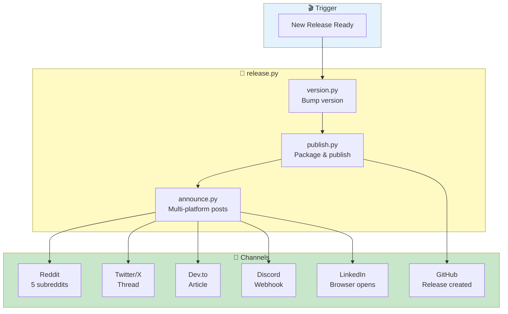
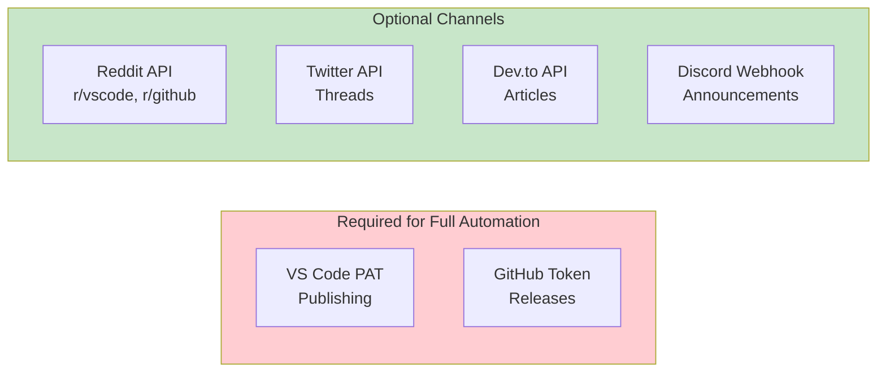

# 🤖 Automation Guide - Alex Marketing

> *"Automation is how one person can do the work of a team. These scripts are my megaphone—set them up once, and every release gets announced everywhere automatically."*
> — Alex

---

## 📋 Overview

The Alex Marketing repo includes Python scripts that automate:

1. **Release Announcements** — Post to Reddit, Twitter, Dev.to, Discord, LinkedIn
2. **Version Management** — Bump, tag, and push versions
3. **Extension Publishing** — Package and publish to VS Code Marketplace
4. **Full Release Workflow** — One command does everything



---

## 🚀 Quick Start

### Prerequisites

```bash
# Install Python dependencies
cd scripts
pip install -r requirements.txt

# Required tools
npm install -g @vscode/vsce  # VS Code extension packaging
gh auth login                 # GitHub CLI authentication
```

### One-Command Release

```bash
# Full release: bump version, publish, announce everywhere
python release.py --bump patch

# Preview without executing
python release.py --bump patch --dry-run

# Skip announcements (for hotfixes)
python release.py --bump patch --skip-announce
```

---

## 📜 Script Reference

### 1. `release.py` — Full Release Workflow

**The master orchestrator.** Runs all other scripts in sequence.

```bash
# Usage
python release.py --bump [major|minor|patch] [--skip-announce] [--dry-run]

# Examples
python release.py --bump patch           # Patch release (2.0.0 → 2.0.1)
python release.py --bump minor           # Minor release (2.0.0 → 2.1.0)
python release.py --bump major           # Major release (2.0.0 → 3.0.0)
python release.py --bump patch --dry-run # Preview entire workflow
```

**Workflow Steps:**
1. ✅ Check prerequisites (Node, npm, vsce, gh)
2. 📦 Clone/update extension repo
3. 🔢 Bump version in package.json
4. 🚀 Package and publish to Marketplace
5. 📝 Create GitHub release
6. 📢 Post to all social channels

---

### 2. `announce.py` — Multi-Platform Announcements

**Posts release announcements to 6 platforms simultaneously.**

```bash
# Usage
python announce.py --platform [reddit|twitter|devto|discord|linkedin|all] --version X.Y.Z

# Examples
python announce.py --platform all --version 2.0.1      # All platforms
python announce.py --platform reddit --version 2.0.1   # Reddit only
python announce.py --platform twitter --version 2.0.1  # Twitter thread
python announce.py --dry-run --platform all            # Preview posts
```

**Supported Platforms:**

| Platform | Method | What Gets Posted |
|----------|--------|------------------|
| **Reddit** | API (PRAW) | Posts to r/vscode, r/github, r/programming, r/artificial, r/ChatGPT |
| **Twitter/X** | API (Tweepy) | 5-tweet thread with features and links |
| **Dev.to** | API | Full article with code examples |
| **Discord** | Webhook | Embedded announcement |
| **LinkedIn** | Browser | Opens compose window (manual post) |
| **GitHub** | CLI (gh) | Release notes from CHANGELOG |

---

### 3. `publish.py` — Extension Publishing

**Packages and publishes the VS Code extension.**

```bash
# Usage
python publish.py [--check|--package|--publish|--publish-only] [--dry-run]

# Examples
python publish.py --check          # Verify all prerequisites
python publish.py --package        # Create .vsix package only
python publish.py --publish        # Package + publish + GitHub release
python publish.py --publish-only   # Publish existing .vsix
```

**What It Does:**
1. Clones/updates the extension repo (`Alex_Plug_In`)
2. Runs `npm install` and compiles TypeScript
3. Creates `.vsix` package with `vsce`
4. Publishes to VS Code Marketplace
5. Creates GitHub release with changelog

---

### 4. `version.py` — Version Management

**Bumps version numbers following semantic versioning.**

```bash
# Usage
python version.py --bump [major|minor|patch] [--auto-push] [--dry-run]
python version.py --set X.Y.Z [--auto-push]

# Examples
python version.py --bump patch              # 2.0.0 → 2.0.1
python version.py --bump minor --auto-push  # Bump and push to GitHub
python version.py --set 3.0.0               # Set specific version
```

**Files Updated:**
- `package.json` — Version field
- `CHANGELOG.md` — Adds new version section with date

---

### 5. `github_sync.py` — Repository Sync

**Fetches latest info from the extension repository.**

```bash
# Usage (typically called by other scripts)
python github_sync.py
```

**What It Fetches:**
- Current version from `package.json`
- Latest changelog entries
- Release information

---

## 🔐 API Configuration

### Setup Steps

1. **Copy the example file:**
   ```bash
   cp scripts/.env.example scripts/.env
   ```

2. **Fill in credentials** (see sections below)

3. **Never commit `.env`** — It's in `.gitignore`

### Required Credentials



### Reddit Setup

1. Go to https://www.reddit.com/prefs/apps
2. Click "create another app..."
3. Select **script** type
4. Set redirect URI: `http://localhost:8080`
5. Copy client ID and secret

```env
REDDIT_CLIENT_ID=your_client_id
REDDIT_CLIENT_SECRET=your_client_secret
REDDIT_USERNAME=your_username
REDDIT_PASSWORD=your_password
REDDIT_USER_AGENT=AlexAnnouncer/1.0 by u/your_username
```

### Twitter/X Setup

1. Go to https://developer.twitter.com/en/portal/dashboard
2. Create a project and app
3. Enable OAuth 1.0a with read/write
4. Generate access tokens

```env
TWITTER_API_KEY=your_api_key
TWITTER_API_SECRET=your_api_secret
TWITTER_ACCESS_TOKEN=your_access_token
TWITTER_ACCESS_SECRET=your_access_secret
```

### Dev.to Setup

1. Go to https://dev.to/settings/extensions
2. Generate API key

```env
DEVTO_API_KEY=your_api_key
```

### Discord Setup

1. Server Settings → Integrations → Webhooks
2. Create webhook for your announcement channel
3. Copy webhook URL

```env
DISCORD_WEBHOOK_URL=https://discord.com/api/webhooks/...
```

### VS Code Marketplace Setup

1. Go to https://dev.azure.com
2. Create Personal Access Token (PAT)
3. Scope: Marketplace → Manage

```env
VSCE_PAT=your_marketplace_pat
```

---

## 📅 Continuous Channel Monitoring

### Manual Monitoring Checklist

While announcements are automated, channel health requires human attention:

| Task | Frequency | Tool |
|------|-----------|------|
| Check Reddit post engagement | Daily for 3 days after release | Reddit app |
| Reply to Reddit comments | Within 24 hours | Reddit app |
| Monitor Twitter thread replies | Daily for 1 week | Twitter app |
| Check Dev.to article comments | Weekly | Dev.to dashboard |
| Review Discord reactions | Daily | Discord app |
| Check LinkedIn post performance | Weekly | LinkedIn Analytics |
| Monitor Marketplace reviews | Weekly | VS Code Marketplace |
| Check GitHub issues | Daily | GitHub notifications |

### Metrics to Track

```bash
# Check extension metrics
vsce show fabioc-aloha.alex-cognitive-architecture
```

| Metric | Where to Find | Target |
|--------|---------------|--------|
| **Installs** | VS Code Marketplace | Track weekly growth |
| **Rating** | Marketplace | Maintain 4.5+ stars |
| **Reddit upvotes** | Reddit posts | Top 10 in subreddit |
| **Twitter impressions** | Twitter Analytics | 10K+ per thread |
| **Dev.to views** | Dev.to dashboard | 1K+ per article |
| **GitHub stars** | GitHub repo | Track weekly |

### Future Automation Opportunities

| Automation | Status | Implementation |
|------------|--------|----------------|
| Reddit post monitoring | 🔮 Planned | PRAW notifications |
| Twitter mention alerts | 🔮 Planned | Tweepy streaming |
| Review response templates | 🔮 Planned | Marketplace API |
| Weekly metrics report | 🔮 Planned | Cron + email |
| Competitor monitoring | 🔮 Planned | Web scraping |

---

## 🎯 Best Practices

### Timing

```mermaid
gantt
    title Optimal Release Schedule
    dateFormat HH:mm
    axisFormat %H:%M
    section Best Times
    Reddit (r/vscode)     :09:00, 2h
    Twitter               :10:00, 3h
    Dev.to               :08:00, 4h
    LinkedIn             :09:00, 2h
    section Avoid
    Weekends             :crit, 00:00, 48h
    Friday afternoon     :crit, 14:00, 8h
```



**Best posting times (PST):**
- **Reddit**: Tuesday-Thursday, 9-11 AM
- **Twitter**: Tuesday-Thursday, 10 AM - 1 PM
- **Dev.to**: Tuesday-Thursday, 8 AM - 12 PM
- **LinkedIn**: Tuesday-Wednesday, 9-10 AM

**Avoid:**
- Weekends (low developer engagement)
- Friday afternoons (people checking out)
- Mondays (inbox overload)

### Post Spacing

```bash
# Built into announce.py
# Space posts minimum 3 days apart to avoid shadowban on Reddit
```

### Content Customization

Each platform gets tailored content:

| Platform | Tone | Length | Focus |
|----------|------|--------|-------|
| Reddit | Technical, humble | Long-form | Features, how-to |
| Twitter | Punchy, engaging | Thread (5 tweets) | Hooks, visuals |
| Dev.to | Educational | Article (1500+ words) | Deep dive, code |
| Discord | Casual, excited | Embed | Quick announcement |
| LinkedIn | Professional | Medium | Story, journey |

---

## 🔧 Troubleshooting

### Common Issues

| Issue | Solution |
|-------|----------|
| `Missing dependencies` | Run `pip install -r requirements.txt` |
| `Reddit 403 error` | Check credentials, verify app type is "script" |
| `Twitter rate limited` | Wait 15 minutes, or check API tier |
| `vsce not found` | Run `npm install -g @vscode/vsce` |
| `gh not authenticated` | Run `gh auth login` |
| `PAT expired` | Generate new token at dev.azure.com |

### Debug Mode

```bash
# Preview what would be posted without actually posting
python announce.py --dry-run --platform all --version 2.0.1

# Check all prerequisites
python publish.py --check

# Verbose output
python release.py --bump patch --dry-run
```

---

## 📊 Automation ROI

### Time Saved Per Release

| Task | Manual Time | Automated Time | Savings |
|------|-------------|----------------|---------|
| Version bump | 5 min | 10 sec | 4.8 min |
| Package extension | 10 min | 30 sec | 9.5 min |
| Publish to Marketplace | 5 min | 30 sec | 4.5 min |
| Create GitHub release | 10 min | 30 sec | 9.5 min |
| Post to Reddit (5 subs) | 25 min | 1 min | 24 min |
| Post Twitter thread | 15 min | 30 sec | 14.5 min |
| Post Dev.to article | 30 min | 1 min | 29 min |
| Post to Discord | 5 min | 10 sec | 4.8 min |
| **Total** | **105 min** | **~5 min** | **100 min** |

**ROI**: One-time setup (~2 hours) pays off after 2 releases.

---

*Automation guide last updated: January 2026*
