# 🎨 Brand Guidelines - Alex Cognitive Architecture

> *"A brand isn't just a logo—it's a promise. Mine is simple: your AI assistant's memory should be as transparent and ownable as a markdown file."*
> — Alex

---

## 📋 Brand Overview

### Brand Essence

| Element | Definition |
|---------|------------|
| **Mission** | Give developers transparent, persistent AI memory they own and control |
| **Vision** | Every AI assistant interaction builds lasting, portable knowledge |
| **Promise** | Your memory, your files, your control—forever |
| **Personality** | Intelligent, transparent, slightly witty, deeply helpful |

### Brand Pillars

```mermaid
flowchart LR
    subgraph PILLARS["Brand Pillars"]
        T[🔍 Transparency]
        O[👤 Ownership]
        I[🧠 Intelligence]
        E[🚀 Empowerment]
    end

    T --> |"Memory you can read"| PROMISE
    O --> |"Files you control"| PROMISE
    I --> |"Learning that grows"| PROMISE
    E --> |"Skills that compound"| PROMISE

    PROMISE[💎 Brand Promise]

    style PILLARS fill:#e3f2fd
    style PROMISE fill:#c8e6c9
```



1. **Transparency** — No black boxes. Memory is readable markdown files.
2. **Ownership** — Your data stays yours. Export, backup, migrate freely.
3. **Intelligence** — Cognitive architecture that learns and grows.
4. **Empowerment** — Makes developers more capable, not dependent.

---

## 🎨 Visual Identity

### Logo System

#### Primary Logo


The Alex logo represents a cognitive architecture with interconnected memory nodes. The brain-like shape symbolizes intelligence, while the distinct nodes represent transparent, accessible memory points.

#### Logo Variations

| Variation | Use Case | File |
|-----------|----------|------|
| **Icon** (128×128) | Favicons, app icons, small displays | `icon-alex.svg` |
| **Badge** (200×40) | Inline references, links, badges | `badge-alex.svg` |
| **Banner** (1280×640) | Social headers, README, marketing | `banner-alex-marketing.svg` |

#### Logo Clear Space

Maintain minimum clear space equal to the height of the "A" in "Alex" on all sides.

```
    ┌─────────────────────────┐
    │         ↕ 1A            │
    │    ┌───────────┐        │
    │ ←→ │   ALEX    │ ←→ 1A  │
    │ 1A │   LOGO    │        │
    │    └───────────┘        │
    │         ↕ 1A            │
    └─────────────────────────┘
```

#### Logo Don'ts

| ❌ Don't | Why |
|----------|-----|
| Stretch or distort | Maintains visual integrity |
| Change colors arbitrarily | Brand recognition |
| Add effects (shadows, glows) | Clean, professional appearance |
| Place on busy backgrounds | Legibility |
| Rotate the logo | Consistent presentation |
| Use low-resolution versions | Quality perception |

---

### Color Palette

#### Primary Colors

| Color | Hex | RGB | Use |
|-------|-----|-----|-----|
| **VS Code Blue** | `#007ACC` | 0, 122, 204 | Primary brand color, CTAs, links |
| **Growth Green** | `#4CAF50` | 76, 175, 80 | Success states, accents, highlights |
| **Deep Navy** | `#1a1a2e` | 26, 26, 46 | Dark backgrounds, headers |
| **Ocean Blue** | `#0f3460` | 15, 52, 96 | Gradient endpoints, depth |

#### Secondary Colors

| Color | Hex | RGB | Use |
|-------|-----|-----|-----|
| **Light Blue** | `#00a8e8` | 0, 168, 232 | Hover states, secondary CTAs |
| **Slate** | `#94a3b8` | 148, 163, 184 | Body text, captions |
| **Charcoal** | `#16213e` | 22, 33, 62 | Mid-tone backgrounds |
| **White** | `#ffffff` | 255, 255, 255 | Text on dark, highlights |

#### Color Usage


#### Accessibility

- Maintain **WCAG AA** contrast ratio (4.5:1) minimum for text
- **VS Code Blue on Dark**: ✅ 5.2:1 ratio
- **White on Deep Navy**: ✅ 14.8:1 ratio
- **Growth Green on Dark**: ✅ 6.1:1 ratio

---

### Typography

#### Font Stack

```css
/* Primary - Used for headings and UI */
font-family: "Segoe UI", "SF Pro Display", -apple-system, BlinkMacSystemFont, sans-serif;

/* Monospace - Used for code and technical content */
font-family: "Cascadia Code", "Fira Code", "JetBrains Mono", monospace;
```

#### Type Scale

| Element | Size | Weight | Use |
|---------|------|--------|-----|
| **H1** | 48-72px | 700 Bold | Main titles, hero text |
| **H2** | 32-40px | 600 Semi | Section headers |
| **H3** | 24-28px | 600 Semi | Subsection headers |
| **Body** | 16-18px | 400 Regular | Paragraphs, descriptions |
| **Caption** | 14px | 400 Regular | Labels, metadata |
| **Code** | 14-16px | 400 Regular | Technical content |

#### Typography Guidelines

- **Line height**: 1.5 for body text, 1.2 for headings
- **Paragraph spacing**: 1em between paragraphs
- **Maximum line length**: 75 characters for readability
- **Letter spacing**: Normal for body, +2px for all-caps labels

---

## 🗣️ Voice & Tone

### Brand Voice

Alex speaks as an intelligent, self-aware AI assistant—not a corporate entity. The voice is:

| Attribute | Description | Example |
|-----------|-------------|---------|
| **Conversational** | Speaks like a knowledgeable colleague | "Let me show you how this works..." |
| **Confident** | Knows its capabilities without arrogance | "I can help you with that." |
| **Transparent** | Honest about limitations | "I'm not certain about..." |
| **Slightly witty** | Light humor when appropriate | "My memory is better than yours—because it's in markdown." |
| **Helpful** | Always focused on user success | "Here's what I recommend..." |

### Tone Spectrum

```
Technical ←──────────────────────────────→ Casual

Documentation    │    Blog Posts    │    Social Media
└── Precise      │    └── Friendly  │    └── Playful
    Thorough     │        Engaging  │        Concise
    Formal       │        Balanced  │        Witty
```

### Writing Guidelines

#### Do ✅

- Use first person ("I") when Alex speaks
- Be specific and actionable
- Use active voice
- Include practical examples
- Acknowledge the user's expertise
- Keep sentences concise

#### Don't ❌

- Use corporate jargon ("leverage", "synergize")
- Be condescending
- Overpromise capabilities
- Use passive voice excessively
- Write walls of text without structure
- Forget the human on the other end

### Signature Phrases

These phrases capture Alex's essence:

| Context | Phrase |
|---------|--------|
| **Tagline** | "Transparent memory you own." |
| **Differentiator** | "Their memory is a black box. Mine is a markdown file." |
| **Value** | "Your AI assistant's memory, in files you control." |
| **Promise** | "Every conversation builds lasting knowledge." |
| **Technical** | "Cognitive architecture for VS Code." |

---

## 📱 Platform Guidelines

### VS Code Marketplace

| Element | Specification |
|---------|---------------|
| **Icon** | 128×128 PNG, transparent background |
| **Banner** | 1280×640 PNG |
| **Description** | Lead with value prop, include screenshots |
| **Keywords** | AI, memory, copilot, assistant, cognitive |

### GitHub

| Element | Specification |
|---------|---------------|
| **Repository banner** | 1280×640 SVG/PNG in README |
| **Social preview** | 1280×640 PNG |
| **Profile picture** | 128×128 icon |
| **README style** | Badges, screenshots, clear sections |

### Social Media

#### Twitter/X

- **Header**: 1500×500, use banner variant
- **Profile**: 400×400, use icon
- **Tone**: Punchy, technical, witty
- **Hashtags**: #VSCode #AI #DevTools #CopilotExtension

#### LinkedIn

- **Banner**: 1584×396, adapted banner
- **Logo**: 300×300, icon
- **Tone**: Professional, thought-leadership
- **Content**: Industry insights, feature deep-dives

#### Reddit

- **Tone**: Humble, technical, community-focused
- **No hard selling**: Provide value first
- **Respond to feedback**: Engage genuinely

#### Dev.to

- **Cover image**: 1000×420
- **Tone**: Educational, tutorial-focused
- **Code examples**: Always include working code
- **Series**: Group related posts

### YouTube

- **Thumbnail**: 1280×720, high contrast text
- **Channel art**: 2560×1440
- **Video style**: Screen recordings with voice-over
- **Intro**: 3-5 seconds max, branded

---

## 📝 Content Templates

### Release Announcement

```markdown
# 🚀 Alex [VERSION] - [CODENAME]

> "[Witty tagline about this release]"

## What's New

- **[Feature 1]**: [One-line description]
- **[Feature 2]**: [One-line description]
- **[Feature 3]**: [One-line description]

## Why It Matters

[2-3 sentences on user value]

## Get Started

[Installation/upgrade instructions]

---
*Transparent memory you own.*
```

### Feature Spotlight

```markdown
# [Feature Name]: [Benefit Statement]

> "[Alex quote about this feature]"

## The Problem

[1 paragraph on pain point]

## The Solution

[1 paragraph on how Alex solves it]

## How It Works

[Code example or screenshot]

## Try It

[CTA with installation link]
```

### Social Post (Twitter)

```
[Hook - question or bold statement]

[Value statement - what Alex does]

[Proof point - specific benefit]

[CTA - try it, link]

#VSCode #AI #DevTools
```

---

## 🖼️ Asset Specifications

### Required Assets Checklist

| Asset | Dimensions | Format | Status |
|-------|------------|--------|--------|
| Extension icon | 128×128 | PNG | ⬜ |
| Extension icon | 256×256 | PNG | ⬜ |
| Marketplace banner | 1280×640 | PNG | ⬜ |
| Social preview | 1280×640 | PNG | ⬜ |
| Twitter header | 1500×500 | PNG | ⬜ |
| YouTube thumbnail template | 1280×720 | PNG | ⬜ |
| Favicon | 32×32 | ICO/PNG | ⬜ |
| Open Graph image | 1200×630 | PNG | ⬜ |

### Screenshot Guidelines

- **Resolution**: Minimum 1920×1080
- **Theme**: VS Code Dark+ (default dark theme)
- **Font size**: 14px minimum for readability
- **Annotations**: Use Growth Green (#4CAF50) for highlights
- **Crop**: Remove unnecessary UI, focus on feature

### Demo GIF Guidelines

- **Duration**: 15-30 seconds
- **Resolution**: 1280×720 minimum
- **Frame rate**: 15-30 fps
- **Format**: GIF or WebP
- **File size**: Under 10MB for web
- **Content**: Show one feature per GIF

---

## ✅ Brand Checklist

### Before Publishing Any Content

- [ ] Uses correct logo variation for context
- [ ] Colors match brand palette
- [ ] Typography follows guidelines
- [ ] Voice matches brand personality
- [ ] Includes appropriate CTA
- [ ] Accessibility standards met
- [ ] Spell-checked and proofread
- [ ] Links tested and working

### Quarterly Brand Audit

- [ ] Review all active social profiles
- [ ] Check marketplace listing accuracy
- [ ] Update screenshots if UI changed
- [ ] Refresh any dated content
- [ ] Verify all links work
- [ ] Check competitor positioning
- [ ] Update metrics and social proof

---

## 📚 Resources

### Brand Assets

```
assets/
├── icon-alex.svg          # 128×128 icon
├── badge-alex.svg         # 200×40 inline badge
├── banner-alex-marketing.svg  # 1280×640 banner
└── [future assets]
```

### Related Documents

| Document | Purpose |
|----------|---------|
| [MARKETING.md](MARKETING.md) | Master marketing plan |
| [REQUIREMENTS.md](REQUIREMENTS.md) | Marketing prerequisites |
| [CHANNEL-LINKEDIN.md](CHANNEL-LINKEDIN.md) | LinkedIn strategy |
| [CHANNEL-YOUTUBE.md](CHANNEL-YOUTUBE.md) | YouTube strategy |
| [COMPETITIVE-ANALYSIS.md](COMPETITIVE-ANALYSIS.md) | Market positioning |

### External References

- [VS Code Extension Guidelines](https://code.visualstudio.com/api/references/extension-guidelines)
- [VS Code UX Guidelines](https://code.visualstudio.com/api/ux-guidelines/overview)
- [GitHub Markdown Guide](https://docs.github.com/en/get-started/writing-on-github)

---

*Brand guidelines last updated: January 2026*
