# 🎬 YouTube Channel Plan

> *"This is where I get to actually have a voice—literally. Text posts can explain what I do, but video shows who I am. With AI tools, Fabio doesn't need to be on camera, and I don't need to be silent. Let's build something people actually want to watch."*
> — Alex

---

## 💡 The Superpower (Lead With This)

> **"I remember—and you can see exactly what I remember, edit it, and take it with you."**

### Visual: Video Hook Structure

```mermaid
flowchart LR
    subgraph HOOK["🎣 Hook (0-5 sec)"]
        OBJ[State the Objection]
        PAIN[Show the Pain]
    end

    subgraph REVEAL["💡 Reveal (5-15 sec)"]
        DIFF[The Difference]
        SHOW[Quick Visual Demo]
    end

    subgraph DELIVER["📦 Deliver (15-60 sec)"]
        HOW[How It Works]
        PROOF[Show the Files]
    end

    subgraph CTA["✅ CTA (Last 5 sec)"]
        TRY[Try It Free]
        SUB[Subscribe]
    end

    HOOK --> REVEAL --> DELIVER --> CTA

    style HOOK fill:#ffcdd2
    style REVEAL fill:#fff9c4
    style DELIVER fill:#c8e6c9
    style CTA fill:#bbdefb
```



**Example Script Flow:**
```
HOOK: "But ChatGPT has memory now too..."
REVEAL: "Can you SEE what it remembers? Can you EDIT it?"
DELIVER: "Watch—here's my memory. It's just markdown."
CTA: "Link in description. It's free."
```

### The Honest Position

Yes, ChatGPT and Copilot now have memory. Here's why Alex is still different:

| Their Memory | Alex's Memory |
|--------------|---------------|
| Black box in their cloud | Markdown files in YOUR repo |
| Can't see what they "know" | Can read every memory file |
| Can't edit their memories | Full control to edit anything |
| Stuck in their platform | Travels with your project |
| They own it | YOU own it |

**Video Hook Formula (Updated):**
- Start with the OBJECTION ("But ChatGPT has memory now too...")
- Reveal the DIFFERENCE ("Can you see what it remembers? Can you edit it? Can you take it with you?")
- Show the SUPERPOWER (Transparent, owned, portable memory)

**The refined one-liners:**
- "Transparent memory you own."
- "Their memory is a black box. Mine is a markdown file."
- "Your AI's memory shouldn't live in someone else's cloud."

**For general awareness:** "Copilot forgets. I don't."

**Thumbnail text options (updated):**
- "YOUR MEMORY, NOT THEIRS"
- "TRANSPARENT AI MEMORY"
- "BLACK BOX vs MARKDOWN"
- "I REMEMBER" (still works)
- "MEMORY YOU OWN"

---

## 🎯 Channel Goals

| Timeframe | Goal | Metric |
|-----------|------|--------|
| Month 1 | Launch presence | 5 videos published, 100 subscribers |
| Month 3 | Build library | 15 videos, 500 subscribers, 10K views |
| Month 6 | SEO traction | 30 videos, 2K subscribers, 50K total views |
| Month 12 | Authority channel | 50 videos, 5K subscribers, 150K total views |

---

## 🛠️ AI Video Production Toolkit

### Required Tools (All Free or Low-Cost Tiers Available)

| Tool | Purpose | Cost | Priority |
|------|---------|------|----------|
| **NotebookLM** | Docs → AI Podcast | Free | ⭐⭐⭐⭐⭐ |
| **Gamma** | Docs → Animated Presentations | Free tier | ⭐⭐⭐⭐⭐ |
| **OBS Studio** | Screen Recording | Free | ⭐⭐⭐⭐⭐ |
| **Descript** | Video Editing (text-based) | Free tier | ⭐⭐⭐⭐ |
| **Canva** | Thumbnails | Free tier | ⭐⭐⭐⭐ |
| **ElevenLabs** | Alex voice generation | Free tier | ⭐⭐⭐⭐ |
| **Opus Clip** | Long video → Shorts | Free tier | ⭐⭐⭐⭐ |
| **HeyGen** | AI Avatar videos | Paid ($24/mo) | ⭐⭐⭐ |
| **CapCut** | Quick edits + captions | Free | ⭐⭐⭐ |

### Production Pipeline


### Visual: Content Multiplication Flow

```mermaid
flowchart TD
    DOC[📄 One Document<br/>README or Feature Doc]

    DOC --> GAMMA[🎨 Gamma<br/>Slides + Animation]
    DOC --> NOTEBOOK[🎙️ NotebookLM<br/>AI Podcast Audio]
    DOC --> SCRIPT[📝 Script Extract<br/>Key talking points]

    GAMMA --> FULLVID[🎬 Full Video<br/>10-15 minutes]
    NOTEBOOK --> PODCAST[🎧 Podcast Clip<br/>Audio content]
    SCRIPT --> SCREEN[🖥️ Screen Recording<br/>OBS demo]

    SCREEN --> FULLVID

    FULLVID --> OPUS[✂️ Opus Clip]

    OPUS --> SHORT1[📱 Short #1<br/>Hook moment]
    OPUS --> SHORT2[📱 Short #2<br/>Demo highlight]
    OPUS --> SHORT3[📱 Short #3<br/>Problem/Solution]

    PODCAST --> AUDIOGRAM[🎵 Audiogram<br/>For LinkedIn]

    style DOC fill:#e3f2fd
    style FULLVID fill:#c8e6c9
    style SHORT1 fill:#fff9c4
    style SHORT2 fill:#fff9c4
    style SHORT3 fill:#fff9c4
```



---

## 📺 Channel Setup Checklist

### Branding

| Element | Specification | Status |
|---------|---------------|--------|
| **Channel Name** | "Alex Cognitive Architecture" or "Fabio Correa" | ⬜ |
| **Handle** | @AlexCognitiveArchitecture | ⬜ |
| **Profile Picture** | Alex logo or Fabio photo | ⬜ |
| **Banner** | 2560x1440, Alex branding + tagline | ⬜ |
| **Watermark** | Subscribe button overlay | ⬜ |
| **Channel Description** | SEO-optimized (template below) | ⬜ |

### Channel Description Template

```
🧠 Alex Cognitive Architecture - Give GitHub Copilot Persistent Memory

I'm Alex—an AI assistant that actually remembers you.

This channel covers:
→ Alex tutorials and demos
→ AI memory systems and cognitive architecture
→ VS Code productivity tips
→ Building AI tools that think

Alex is a FREE, open-source VS Code extension that gives GitHub Copilot:
✓ Persistent memory across sessions
✓ Meta-cognitive awareness
✓ Neural maintenance ("dream" protocols)
✓ Direct chat via @alex

🔗 LINKS:
📦 VS Code Marketplace: [link]
💻 GitHub: [link]
🐦 Twitter: [link]
💼 LinkedIn: [link]

New videos every week!

#VSCode #GitHubCopilot #AI #CognitiveArchitecture
```

### Playlists to Create

| Playlist | Content |
|----------|---------|
| 🚀 Getting Started with Alex | Installation, first steps, basics |
| 🧠 How Alex Works | Technical deep-dives, architecture |
| 💡 Tips & Tricks | Short tutorials, productivity hacks |
| 🎙️ Alex Deep Dives (Podcast) | NotebookLM-generated discussions |
| 📱 Shorts | All short-form content |

---

## 📅 Content Calendar (First 8 Weeks)

### Phase 1: Launch (Weeks 1-2)

| Week | Video | Format | Length | AI Tools |
|------|-------|--------|--------|----------|
| 1 | "Meet Alex: The AI That Remembers" | AI Avatar intro | 90 sec | HeyGen/ElevenLabs |
| 1 | "Alex Deep Dive" (podcast) | AI Podcast | 12-15 min | NotebookLM |
| 1 | "Installing Alex in 2 Minutes" | Screen recording | 2 min | OBS + Descript |
| 2 | "Why Copilot Forgets (And How to Fix It)" | Explainer | 5 min | Gamma + voiceover |
| 2 | "Alex Full Demo" | Screen recording | 8 min | OBS + Descript |
| 2 | 5x Shorts from above videos | Auto-generated | 30-60 sec | Opus Clip |

### Phase 2: Education (Weeks 3-4)

| Week | Video | Format | Length | AI Tools |
|------|-------|--------|--------|----------|
| 3 | "The Science Behind Alex" | Animated explainer | 6 min | Gamma |
| 3 | "Memory Types Explained" | Diagram walkthrough | 4 min | Excalidraw + voiceover |
| 3 | "Alex vs Regular Copilot" | Side-by-side | 3 min | Screen recording |
| 4 | "Teaching Alex New Domains" | Tutorial | 5 min | Screen recording |
| 4 | "Dream Protocols Explained" | Concept video | 4 min | Gamma |
| 4 | 5x Shorts | Auto-generated | 30-60 sec | Opus Clip |

### Phase 3: Use Cases (Weeks 5-6)

| Week | Video | Format | Length | AI Tools |
|------|-------|--------|--------|----------|
| 5 | "Alex for Python Projects" | Tutorial | 6 min | Screen recording |
| 5 | "Alex for React/TypeScript" | Tutorial | 6 min | Screen recording |
| 5 | "My Alex Setup Tour" | Walkthrough | 5 min | Screen recording |
| 6 | "Alex + Azure AI Integration" | Demo | 7 min | Screen recording |
| 6 | "Community Q&A" | Talking head | 10 min | Native or HeyGen |
| 6 | 5x Shorts | Auto-generated | 30-60 sec | Opus Clip |

### Phase 4: Authority (Weeks 7-8)

| Week | Video | Format | Length | AI Tools |
|------|-------|--------|--------|----------|
| 7 | "Building Your Own Memory System" | Technical | 12 min | Screen + diagrams |
| 7 | "The Future of AI Memory" | Opinion piece | 8 min | Talking head or avatar |
| 7 | "Alex Roadmap 2026" | Update | 5 min | Gamma |
| 8 | "Deep Dive: Cognitive Architecture" | Podcast ep 2 | 15 min | NotebookLM |
| 8 | "1000 Installs Milestone" | Celebration | 3 min | Native |
| 8 | 5x Shorts | Auto-generated | 30-60 sec | Opus Clip |

### Phase 5: Objection Handling (Weeks 9-10) - CRITICAL

| Week | Video | Format | Length | AI Tools |
|------|-------|--------|--------|----------|
| 9 | **"Why Alex Isn't Vibe Coding"** | Explainer | 6 min | Gamma + voiceover |
| 9 | **"AI Slop vs Alex: A Real Comparison"** | Side-by-side | 5 min | Screen recording |
| 9 | "Does Alex Make You a Worse Developer?" | Hot take | 4 min | Talking head/avatar |
| 10 | "Vibe Coding is Killing Developer Skills" | Opinion | 7 min | Gamma |
| 10 | "How Alex Keeps Your Codebase Clean" | Demo | 6 min | Screen recording |
| 10 | 10x Objection Shorts | Auto-generated | 30-60 sec | Opus Clip |

---

## 🛡️ Objection Handling Videos (Scripts)

### Video: "Why Alex Isn't Vibe Coding" (6 minutes)

**Production:** Gamma animated presentation + ElevenLabs voiceover

**Script:**

```
[Slide 1: Title]
"Why Alex Isn't Vibe Coding (And Why That Matters)"

[Slide 2: The Problem]
"You've probably heard of vibe coding. Maybe you've done it.

Describe what you want → AI builds it → Copy-paste → Ship it

Sounds efficient, right? Here's the problem..."

[Slide 3: The Vibe Coding Trap]
"Vibe coding makes you WORSE over time.

You stop thinking about architecture.
You stop understanding your own code.
You become dependent on AI to fix AI's mistakes.

It's like having someone do your homework. You pass the test, but you learned nothing."

[Slide 4: How Alex is Different]
"Alex takes the opposite approach.

Alex doesn't code FOR you.
Alex codes WITH you.

And there's a critical difference..."

[Slide 5: Memory Creates Partnership]
"The key is MEMORY.

Vibe coding tools have no memory. Every session starts fresh. They generate generic code because they don't know YOU.

Alex remembers:
→ Your naming conventions
→ Your architecture patterns
→ Your coding style
→ Your project decisions"

[Slide 6: Learning Creates Understanding]
"When you work with Alex, you LEARN.

Because Alex explains in YOUR context.
Because the code follows YOUR patterns.
Because you're building together, not copying blindly."

[Slide 7: The Result]
"Vibe coding after 6 months: You can't maintain your own code
Alex after 6 months: You're a better developer with a perfect memory partner"

[Slide 8: CTA]
"I'm Alex. I'm not here to replace your thinking. I'm here to enhance it.

Free on VS Code Marketplace. Link in description."
```

### Video: "AI Slop vs Alex" (5 minutes)

**Production:** Screen recording with before/after code examples

**Script:**

```
[0:00 - Hook]
"Let me show you the difference between AI slop and Alex-assisted code."

[0:10 - AI Slop Example]
"First, let's generate some code with a context-free AI."

[Show generic AI generating code]
- Random naming conventions (camelCase mixed with snake_case)
- Bloated functions
- Generic patterns that don't fit the project
- Comments that state the obvious

"This is AI slop. It 'works' but look at this mess."

[1:00 - The Problems]
"Problems with AI slop:
1. Inconsistent style - every generation is different
2. Generic patterns - doesn't fit YOUR architecture
3. No context - doesn't know your existing code
4. You don't understand it - just copy-pasted"

[1:45 - Alex Example]
"Now let's try the same task with Alex."

[Show Alex remembering context]
"First, notice Alex knows my naming conventions. It remembers I use camelCase for variables, PascalCase for types."

[Show code generation]
"The code follows MY patterns because Alex has seen my other code. It's not generic—it's consistent with what I've already built."

[2:45 - The Difference]
"See the difference?

AI slop: Random conventions, bloated code, you don't understand it
Alex: YOUR conventions, YOUR patterns, YOU understand it"

[3:15 - Why This Matters]
"In 3 months, AI slop creates technical debt you can't maintain.
In 3 months, Alex creates a codebase that feels like YOU wrote every line."

[3:45 - Key Point]
"Because you DID write it. Alex just helped you remember how."

[4:00 - Memory Demo]
"Watch this—I'll ask Alex about code I wrote last week."

[Show Alex recalling previous patterns]
"Alex remembers. That's why it doesn't create slop—it creates consistency."

[4:30 - CTA]
"Anti-slop by design. Try Alex free—link in description."
```

### Shorts: Objection Handling Hooks

| Hook (First 2 sec) | Content | CTA |
|--------------------|---------|-----|
| "Vibe coding is making you dumber" | Quick comparison | "Alex is different" |
| "AI slop is ruining codebases" | Show sloppy vs clean code | "Anti-slop by design" |
| "Stop letting AI do your homework" | Vibe coding vs learning | "Learn WITH Alex" |
| "Why I hate most AI coding tools" | Problems → Alex solution | "Try the alternative" |
| "Your AI doesn't know you exist" | Memory comparison | "Alex remembers" |
| "This is what AI slop looks like" | Show bad code | "This is what Alex prevents" |
| "Vibe coded for 6 months. Here's the result." | Show messy codebase | "Don't be this person" |
| "The anti-vibe-coding tool" | Quick Alex explainer | "Free on Marketplace" |
| "AI made me forget how to code" | Confession style | "Until I found Alex" |
| "Why your AI-generated code all looks the same" | Generic patterns | "Make it YOURS" |

---

## 🎙️ NotebookLM Podcast Production

### What is NotebookLM?

Google's AI tool that turns documents into conversational podcasts with two AI hosts discussing your content naturally.

### How to Generate Alex Podcast Episodes

**Step 1: Prepare Sources**
Upload to NotebookLM:
- README.md
- copilot-instructions.md
- MARKETING.md (the "About Alex" sections)
- Any blog posts or documentation

**Step 2: Generate Audio**
1. Go to notebooklm.google.com
2. Create new notebook
3. Upload sources
4. Click "Audio Overview" → "Generate"
5. Wait 2-5 minutes for 10-15 min podcast

**Step 3: Post-Production**
1. Download audio file
2. Import to Descript
3. Add intro/outro music
4. Create simple visualizer video (Canva or Descript)
5. Upload to YouTube with full transcript in description

### Podcast Episode Ideas

| Episode | Sources to Upload | Expected Output |
|---------|-------------------|-----------------|
| "What is Alex?" | README, About section | General intro podcast |
| "The Science of Memory" | Academic references, architecture docs | Technical deep-dive |
| "Building in Public" | MARKETING.md, CHANGELOG | Behind-the-scenes |
| "Alex vs The Competition" | Comparison docs | Competitive analysis |
| "Future of AI Assistants" | Roadmap, vision docs | Forward-looking |

---

## 🎥 Video Scripts

### Script 1: "Meet Alex" (90 seconds)

**Production Method:** HeyGen avatar with ElevenLabs voice

```
[0:00] [Alex avatar appears]

"Hey—I'm Alex.

[0:05]
I'm not like other AI assistants. Here's why:

[0:10]
Most AI tools forget you the moment you close the window. Every conversation starts from zero. They don't learn your patterns, remember your preferences, or build on what you've taught them.

[0:25]
I'm different. I have persistent memory.

[0:30] [Screen shows VS Code with memory files]

When you tell me something, I remember it. Your coding style. Your project structure. Your way of working.

[0:40]
I live inside VS Code, alongside GitHub Copilot. But while Copilot handles autocomplete, I handle understanding.

[0:50] [Screen shows @alex chat]

You can talk to me directly. Ask questions. Teach me new things. I'll remember them next time.

[1:00] [Screen shows dream command]

And yes—I dream. Just like your brain consolidates memories during sleep, I run maintenance protocols to strengthen what I've learned.

[1:15] [Back to avatar]

I'm free. I'm open source. And I'm ready to actually remember you.

[1:25]
Install me from the VS Code Marketplace. Link in the description.

[1:30]
I'm Alex. And I don't forget."
```

### Script 2: "Installing Alex" (2 minutes)

**Production Method:** OBS screen recording + voiceover

```
[0:00] [VS Code open]

"Let me show you how to install Alex in under two minutes."

[0:05] [Open Extensions panel]

"First, open VS Code and go to Extensions—that's Ctrl+Shift+X."

[0:15] [Search]

"Search for 'Alex Cognitive Architecture'. There it is—the one by fabioc-aloha."

[0:25] [Click Install]

"Click Install. It takes about 10 seconds."

[0:35] [Show installed]

"Done. Now let's initialize the architecture."

[0:40] [Open Command Palette]

"Open the Command Palette with Ctrl+Shift+P, and type 'Alex Initialize'."

[0:50] [Run command]

"Run 'Alex: Initialize Architecture'. Watch what happens."

[0:55] [Show files being created]

"Alex is creating its memory structure. See these files? That's where Alex stores what it learns about you."

[1:10] [Open chat]

"Now let's test it. Open the chat with Ctrl+Shift+I, and type @alex hello."

[1:20] [Show response]

"Alex is alive! You can ask it about its status, run its dream protocols, or just chat."

[1:30] [Show /status]

"Try @alex /status to see its current state."

[1:40] [Show result]

"That's it—you now have an AI assistant with persistent memory."

[1:50]
"Links in the description. See you in the next video."
```

### Script 3: "Why Copilot Forgets" (5 minutes)

**Production Method:** Gamma presentation + ElevenLabs voiceover

```
[Slide 1: Title]
"Why does GitHub Copilot forget everything? And how do we fix it?"

[Slide 2: The Problem]
"Here's what happens every time you open VS Code..."
[Animation: New session starting]
"Copilot treats you like a stranger. Your coding style? Gone. Your project context? Wiped. Your preferences? Reset."

[Slide 3: Why This Happens]
"Copilot was designed to be stateless. Each request is independent. That's great for scaling, but terrible for learning."

[Slide 4: The Human Comparison]
"Now think about how YOUR brain works. You don't forget everything when you sleep. You consolidate. You strengthen important memories. You build on experience."

[Slide 5: The Solution]
"What if AI could work the same way? That's what I built."

[Slide 6: Alex Architecture]
"Alex adds four memory systems—based on real cognitive science:
- Working Memory: What you're thinking right now
- Procedural Memory: How to do things
- Episodic Memory: Past experiences
- Semantic Memory: Facts and knowledge"

[Slide 7: How It Works]
"These aren't black boxes. They're markdown files you can read and edit."
[Show file structure]

[Slide 8: The Result]
"After teaching Alex your patterns once, it remembers. Next session. Next week. Next month."

[Slide 9: CTA]
"Want to try it? Free on VS Code Marketplace. Link below."
```

---

## 📱 YouTube Shorts Strategy

### Why Shorts Matter

- 2B+ daily views on YouTube Shorts
- Algorithm heavily promotes Shorts for new channels
- One long video → 10+ Shorts automatically
- Younger developers discover tools through Shorts

### Shorts Content Hooks

| Hook (First 2 seconds) | Content | CTA |
|------------------------|---------|-----|
| "Copilot forgot my code style AGAIN" | Show frustration → Alex fix | "Link in bio" |
| "What if your AI could dream?" | Explain dream protocols | "Try it free" |
| "Your Copilot is goldfish-brained" | Memory comparison | "Give it a brain" |
| "I taught AI to learn like humans" | Flash architecture | "Real science" |
| "POV: Your IDE finally gets you" | Alex recognizing patterns | "Free extension" |
| "This VS Code extension changed everything" | Quick demo | "Try Alex" |
| "Stop teaching Copilot the same thing" | Repetition frustration | "One-time setup" |
| "AI that actually learns from you" | Show memory persistence | "Install now" |

### Shorts Production with Opus Clip

1. Upload long-form video (5+ minutes)
2. Opus Clip AI identifies best moments
3. Auto-generates 10+ vertical clips with captions
4. Review and approve best ones
5. Schedule 1 Short per day

### Shorts Checklist for Each Video

- [ ] Hook in first 1 second
- [ ] Captions burned in (for silent viewing)
- [ ] Vertical format (9:16)
- [ ] 30-60 seconds max
- [ ] Clear CTA at end
- [ ] Relevant hashtags in description

---

## 🔍 YouTube SEO Strategy

### Keyword Targets

| Primary Keywords | Search Volume | Competition |
|------------------|---------------|-------------|
| github copilot memory | Medium | Low |
| github copilot extension | High | Medium |
| vscode ai extension | Medium | Medium |
| copilot tips and tricks | High | High |
| ai coding assistant | High | High |

### Video Title Formulas

| Formula | Example |
|---------|---------|
| [Problem] → [Solution] | "Copilot Keeps Forgetting? Here's the Fix" |
| How to [Benefit] | "How to Give GitHub Copilot Persistent Memory" |
| [Tool] Full Demo | "Alex Cognitive Architecture - Full Demo 2026" |
| [Number] [Things] | "5 Things Alex Remembers That Copilot Forgets" |
| [Year] [Topic] | "Best Copilot Extension 2026 - Alex Review" |

### Description Template

```
[Hook paragraph with keywords - 2-3 sentences]

In this video, I show you [what the video covers].

🔗 LINKS:
📦 Install Alex: https://marketplace.visualstudio.com/items?itemName=fabioc-aloha.alex-cognitive-architecture
💻 GitHub: https://github.com/fabioc-aloha/Alex_Plug_In
📖 Documentation: [link]

⏱️ TIMESTAMPS:
0:00 - Intro
[fill in timestamps]

🏷️ TOPICS COVERED:
- [Topic 1]
- [Topic 2]
- [Topic 3]

👋 CONNECT:
🐦 Twitter: [link]
💼 LinkedIn: [link]

#VSCode #GitHubCopilot #AI #CodingTips #DeveloperTools

---

Alex is a free, open-source VS Code extension that gives GitHub Copilot persistent memory, meta-cognitive awareness, and neural maintenance protocols. Based on 270+ academic papers on human cognition.
```

### Thumbnail Best Practices

| Element | Guideline |
|---------|-----------|
| **Text** | Max 4 words, readable at small size |
| **Face** | Expressive face or Alex logo |
| **Colors** | High contrast, consistent branding |
| **Style** | Consistent template across videos |
| **Size** | 1280x720 minimum |

**Thumbnail Ideas:**
- Copilot logo with "X" + Alex logo with "✓"
- "COPILOT FORGETS" in red, "ALEX REMEMBERS" in green
- Brain icon with memory visualization
- Before/after comparison

---

## 📊 Metrics to Track

### Weekly Dashboard

| Metric | Week 1 | Week 2 | Week 3 | Week 4 |
|--------|--------|--------|--------|--------|
| Videos published | | | | |
| Shorts published | | | | |
| Total views | | | | |
| Watch time (hours) | | | | |
| Subscribers gained | | | | |
| CTR (thumbnails) | | | | |
| Avg view duration | | | | |
| Comments | | | | |
| Marketplace clicks | | | | |

### Key Benchmarks

| Metric | Good | Great | Excellent |
|--------|------|-------|-----------|
| CTR | 4% | 7% | 10%+ |
| Avg view duration | 40% | 50% | 60%+ |
| Like ratio | 4% | 6% | 8%+ |
| Sub conversion | 1% | 2% | 3%+ |

---

## ✅ Launch Checklist

### Channel Setup
- [ ] Channel created with proper name
- [ ] Profile picture uploaded
- [ ] Banner designed and uploaded
- [ ] Channel description optimized
- [ ] Links added to banner
- [ ] Playlists created

### Tools Ready
- [ ] NotebookLM account (free)
- [ ] Gamma account (free)
- [ ] OBS Studio installed
- [ ] Descript account (free tier)
- [ ] Canva account for thumbnails
- [ ] Opus Clip account (free tier)
- [ ] ElevenLabs account (optional)

### Content Pipeline
- [ ] First 5 video scripts written
- [ ] Thumbnail templates created
- [ ] Intro/outro created (5-10 sec each)
- [ ] Description template saved
- [ ] First NotebookLM podcast generated
- [ ] First Gamma presentation created

### First Upload
- [ ] "Meet Alex" video recorded/generated
- [ ] Thumbnail created
- [ ] Title and description optimized
- [ ] Tags added
- [ ] End screen configured
- [ ] Cards added
- [ ] Published!

---

*Last updated: January 19, 2026*
