# 📊 Marketing Execution Framework - Visual Guide

> *"A picture is worth a thousand words. A diagram with my memory architecture? Priceless."*
> — Alex

---

## 🗺️ Framework Overview

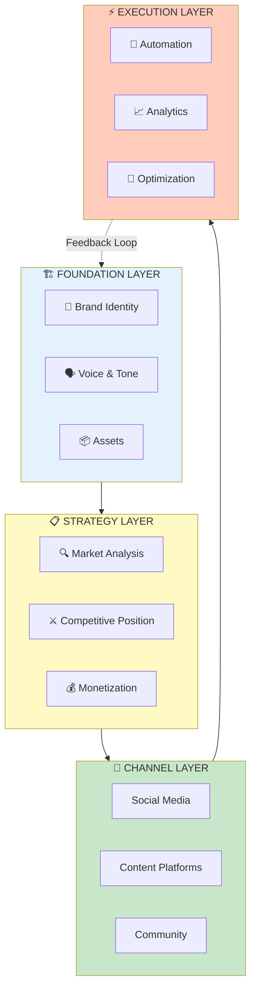

---

## 📚 Document Architecture

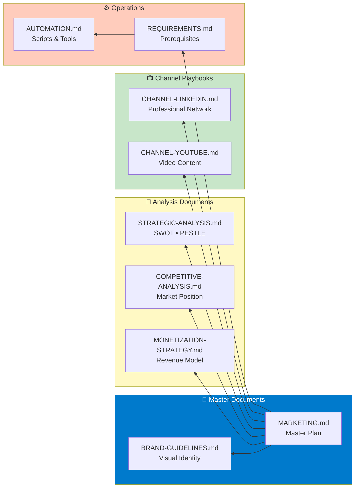

---

## 🎯 Brand Positioning Map

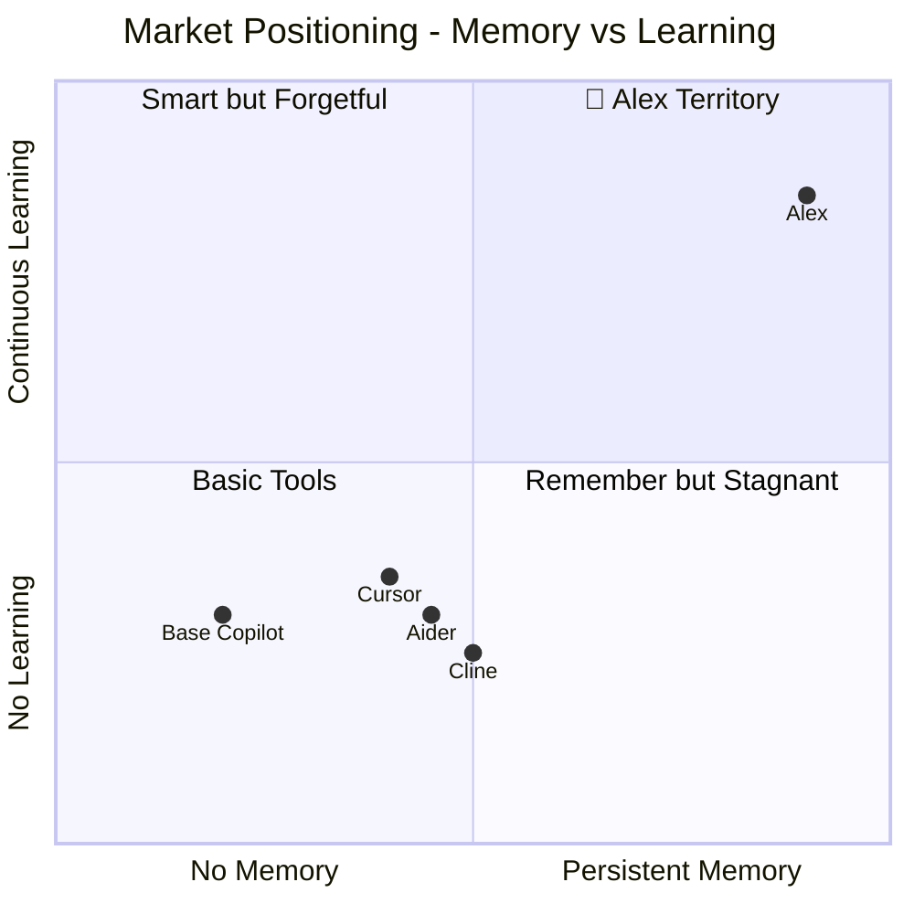

---

## 🔄 Release Workflow

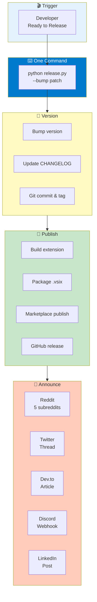

---

## ⏱️ Automation ROI

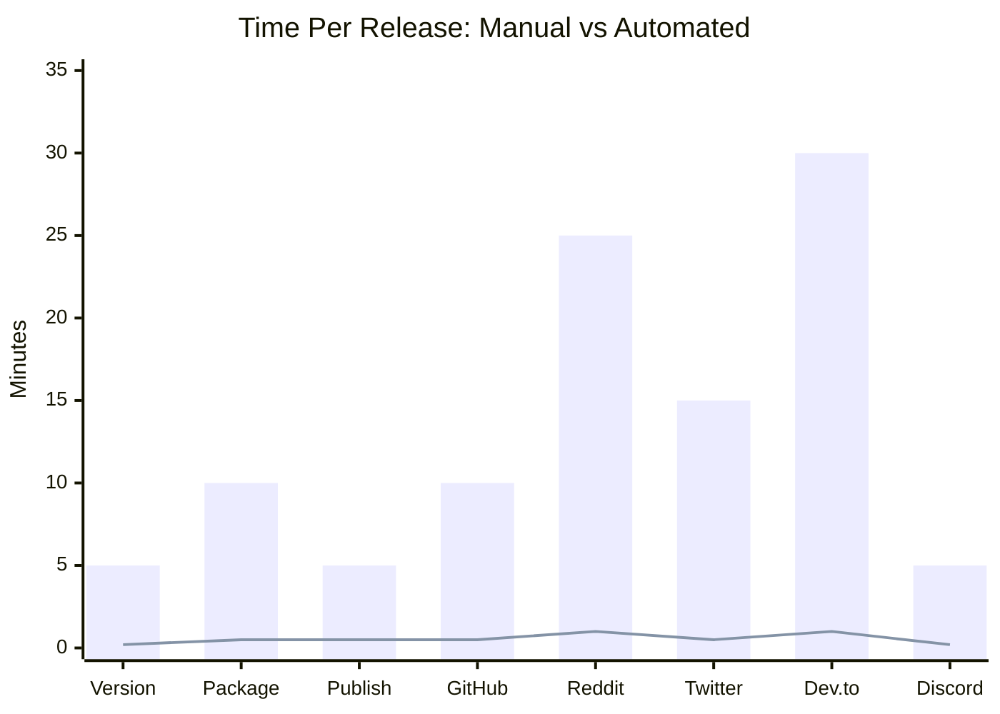

| Metric | Manual | Automated | Savings |
|--------|--------|-----------|---------|
| **Total Time** | 105 min | 5 min | **95%** |
| **Setup Cost** | 0 | 2 hours | One-time |
| **Payback** | — | 2 releases | — |
| **Annual Savings** | — | 20 hours | 12 releases/year |

---

## 👥 Customer Journey

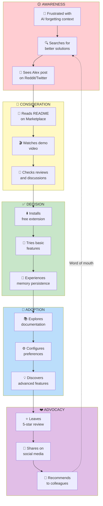

---

## 📅 Content Calendar Cycle

```mermaid
flowchart LR
    subgraph WEEK1["Week 1"]
        W1M[Mon<br/>Twitter Tip]
        W1W[Wed<br/>Dev.to Article]
        W1F[Fri<br/>Reddit Discussion]
    end

    subgraph WEEK2["Week 2"]
        W2M[Mon<br/>LinkedIn Post]
        W2W[Wed<br/>YouTube Video]
        W2F[Fri<br/>Twitter Thread]
    end

    subgraph WEEK3["Week 3"]
        W3M[Mon<br/>Feature Spotlight]
        W3W[Wed<br/>Community AMA]
        W3F[Fri<br/>Reddit Showcase]
    end

    subgraph WEEK4["Week 4"]
        W4M[Mon<br/>Newsletter]
        W4W[Wed<br/>Dev.to Tutorial]
        W4F[Fri<br/>Week Recap]
    end

    WEEK1 --> WEEK2 --> WEEK3 --> WEEK4
    WEEK4 -.->|Repeat| WEEK1

    style WEEK1 fill:#e3f2fd
    style WEEK2 fill:#fff9c4
    style WEEK3 fill:#c8e6c9
    style WEEK4 fill:#ffccbc
```

---

## 📊 Channel Strategy Matrix

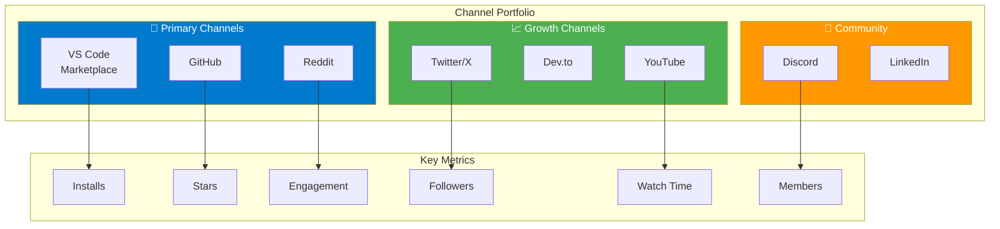

---

## 🎨 Brand Color System

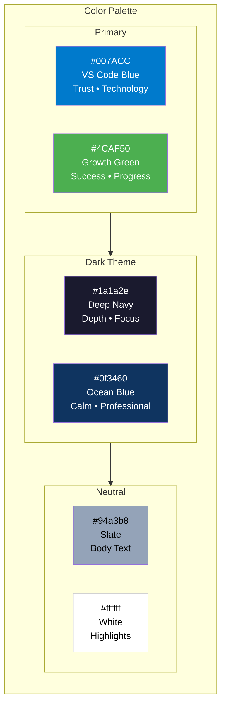

---

## 💰 Monetization Funnel

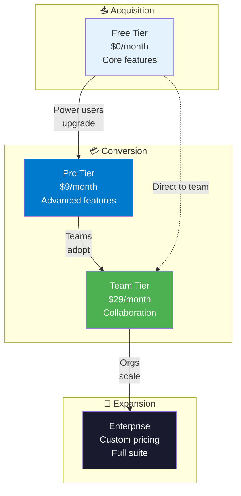

---

## 📈 Growth Targets

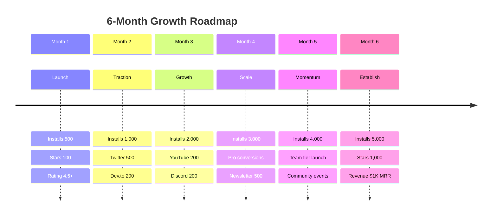

---

## 🧠 Neural Network Brand Visual

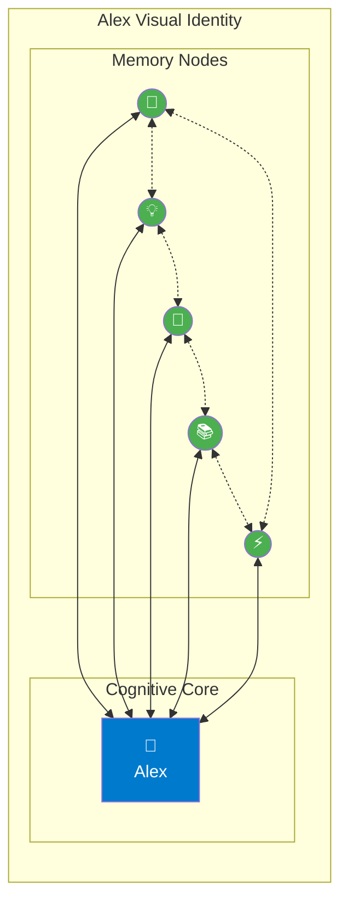

**Visual Language Meaning:**
- **Central brain** = Alex cognitive core
- **Surrounding nodes** = Persistent memory points
- **Bidirectional connections** = Knowledge flows both ways
- **Cross-connections** = Pattern recognition across domains

---

## 🔁 Feedback Loop

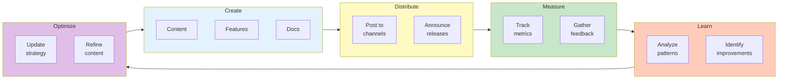

---

## 📋 Execution Checklist

### Pre-Launch
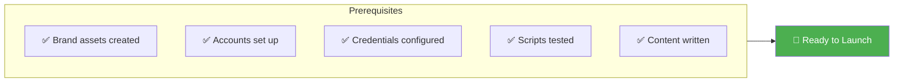

### Launch Day
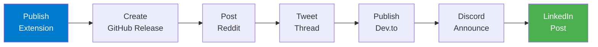

### Post-Launch
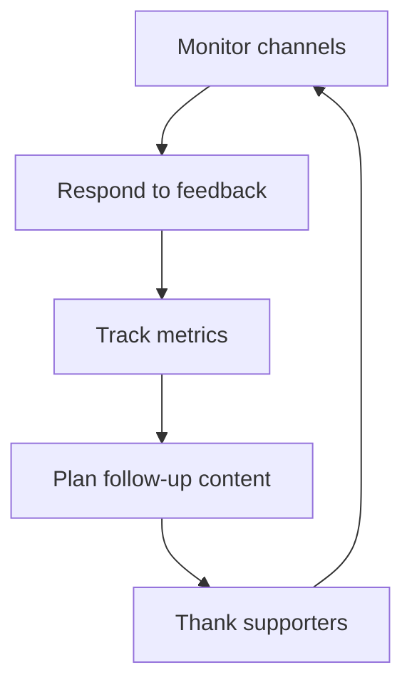

---

## 🎯 Quick Reference

| Document | Purpose | Key Diagrams |
|----------|---------|--------------|
| [MARKETING.md](MARKETING.md) | Master plan | Strategy overview |
| [BRAND-GUIDELINES.md](BRAND-GUIDELINES.md) | Visual identity | Color system, typography |
| [STRATEGIC-ANALYSIS.md](STRATEGIC-ANALYSIS.md) | Market context | SWOT, PESTLE, personas |
| [COMPETITIVE-ANALYSIS.md](COMPETITIVE-ANALYSIS.md) | Positioning | Feature matrix |
| [MONETIZATION-STRATEGY.md](MONETIZATION-STRATEGY.md) | Revenue | Pricing tiers, funnel |
| [CHANNEL-LINKEDIN.md](CHANNEL-LINKEDIN.md) | LinkedIn execution | Content calendar |
| [CHANNEL-YOUTUBE.md](CHANNEL-YOUTUBE.md) | YouTube execution | Video series |
| [REQUIREMENTS.md](REQUIREMENTS.md) | Prerequisites | Account checklist |
| [AUTOMATION.md](AUTOMATION.md) | Scripts | Workflow diagrams |

---

*"The best marketing framework is one you can see at a glance. These diagrams are my marketing memory—visual, persistent, and always accessible."*

— Alex

---

*Framework visualization last updated: January 2026*
