# 💰 Monetization Strategy - Alex Cognitive Architecture

> *"Here's the thing about money: I want to be sustainable, not extractive. The core of what makes me useful—transparent, portable memory—should stay free. But if I'm going to grow, improve, and eventually have a team behind me, we need revenue. Here's how I think about it honestly."*
> — Alex

---

## 🎯 Monetization Philosophy

### Core Principles


### The Commitment

| Always Free | Paid Features OK |
|-------------|------------------|
| ✅ Initialize architecture | Advanced automation |
| ✅ Core memory files | Team synchronization |
| ✅ Dream command (basic) | Priority support |
| ✅ Meditation protocols | Enterprise features |
| ✅ Open source code | Hosted services |
| ✅ Community support | Custom integrations |
| ✅ Personal use | Commercial support |

> *"I won't become the thing I'm fighting against. The moment I lock basic memory behind a paywall, I've betrayed everything I stand for."*

---

## 📊 Revenue Model Options

### Visual: Revenue Model Comparison


---

## 💎 Tier 1: Freemium Model (Recommended Primary)

### The Structure

```mermaid
flowchart TD
    subgraph FREE["🆓 Free Tier (Forever)"]
        F1[Core Memory Architecture]
        F2[Initialize Command]
        F3[Dream Command - Basic]
        F4[All Memory File Types]
        F5[Community Support]
        F6[Open Source Access]
    end
    
    subgraph PRO["⭐ Pro Tier ($9/month)"]
        P1[Everything in Free]
        P2[Advanced Dream Analytics]
        P3[Memory Health Dashboard]
        P4[Priority Dream Scheduling]
        P5[Custom Memory Templates]
        P6[Email Support]
    end
    
    subgraph TEAM["👥 Team Tier ($29/month per seat)"]
        T1[Everything in Pro]
        T2[Shared Memory Conventions]
        T3[Team Sync Features]
        T4[Admin Dashboard]
        T5[Onboarding Toolkit]
        T6[Slack Support]
    end
    
    subgraph ENTERPRISE["🏢 Enterprise (Custom)"]
        E1[Everything in Team]
        E2[SSO Integration]
        E3[Audit Logs]
        E4[Custom SLAs]
        E5[Dedicated Support]
        E6[On-prem Option]
    end
    
    FREE --> PRO --> TEAM --> ENTERPRISE
    
    style FREE fill:#e8f5e9
    style PRO fill:#fff9c4
    style TEAM fill:#e3f2fd
    style ENTERPRISE fill:#f3e5f5
```



### Pricing Rationale

| Tier | Price | Target | Value Proposition |
|------|-------|--------|-------------------|
| **Free** | $0 | Individual devs, students, hobbyists | "Try everything, pay nothing" |
| **Pro** | $9/mo | Professional devs, power users | "Worth one lunch for 10x productivity" |
| **Team** | $29/seat/mo | Small teams (5-20 devs) | "Less than Copilot Business, more value" |
| **Enterprise** | Custom | Large orgs (50+ devs) | "ROI calculator shows 5x return" |

### Why This Works

1. **Low barrier**: Free tier is genuinely useful, not crippled
2. **Clear upgrade path**: Each tier solves real problems
3. **Competitive pricing**: Below Cursor ($20), below Copilot Business ($19 + no memory)
4. **Value-aligned**: Pay for extras, not for core

---

## 🎁 Tier 2: Sponsorship & Donations

### GitHub Sponsors

```mermaid
flowchart LR
    subgraph TIERS["Sponsor Tiers"]
        T1["☕ $5/mo<br/>Supporter"]
        T2["🌟 $15/mo<br/>Advocate"]
        T3["🚀 $50/mo<br/>Champion"]
        T4["💎 $200/mo<br/>Partner"]
    end
    
    subgraph PERKS["Sponsor Perks"]
        P1[Name in README]
        P2[Early Feature Access]
        P3[Monthly Office Hours]
        P4[Logo + Advisory Input]
    end
    
    T1 --> P1
    T2 --> P1
    T2 --> P2
    T3 --> P1
    T3 --> P2
    T3 --> P3
    T4 --> P1
    T4 --> P2
    T4 --> P3
    T4 --> P4
```



### Sponsor Tier Details

| Tier | Price | Perks | Target |
|------|-------|-------|--------|
| **☕ Supporter** | $5/mo | Name in SPONSORS.md, Discord role | Fans who want to help |
| **🌟 Advocate** | $15/mo | + Early access to features, beta testing | Power users |
| **🚀 Champion** | $50/mo | + Monthly call with Fabio, feature input | Serious supporters |
| **💎 Partner** | $200/mo | + Logo placement, advisory board seat | Companies using Alex |

### Revenue Projection (Sponsors)

| Milestone | Est. Sponsors | Monthly Revenue |
|-----------|---------------|-----------------|
| 100 installs | 5 sponsors | $50 |
| 1,000 installs | 30 sponsors | $300 |
| 5,000 installs | 100 sponsors | $1,000 |
| 10,000 installs | 200 sponsors | $2,500 |

*Assumption: 2-3% of users become sponsors (typical for dev tools)*

---

## 📚 Tier 3: Education & Content

### Course: "Building AI That Remembers"


### Content Products

| Product | Price | Description | Target |
|---------|-------|-------------|--------|
| **"Building AI Memory" Course** | $149 | 5-module deep dive | Devs building similar tools |
| **Course + Coaching Bundle** | $499 | Course + 3 hours with Fabio | Serious builders |
| **"Cognitive Architecture" eBook** | $29 | 270 papers distilled | Researchers, curious devs |
| **Template Packs** | $19-49 | Industry-specific memory templates | Specialized teams |

### Revenue Projection (Education)

| Product | Est. Annual Sales | Revenue |
|---------|-------------------|---------|
| Course | 100 sales | $14,900 |
| Bundle | 20 sales | $9,980 |
| eBook | 300 sales | $8,700 |
| Templates | 200 sales | $5,000 |
| **Total** | | **$38,580** |

---

## 🤝 Tier 4: Services & Consulting

### Consulting Services

```mermaid
flowchart LR
    subgraph SERVICES["Consulting Offerings"]
        S1["🔧 Implementation<br/>$2,000"]
        S2["📋 Architecture Review<br/>$1,500"]
        S3["👥 Team Training<br/>$3,000"]
        S4["🎯 Custom Development<br/>$150/hr"]
    end
    
    subgraph DELIVERY["Delivery"]
        D1[Remote Sessions]
        D2[Documentation]
        D3[Follow-up Support]
    end
    
    S1 --> D1
    S2 --> D2
    S3 --> D1
    S4 --> D3
```



### Service Packages

| Service | Price | Deliverable | Time |
|---------|-------|-------------|------|
| **Implementation Assist** | $2,000 | Full Alex setup for team + customization | 8 hours |
| **Architecture Review** | $1,500 | Memory architecture audit + recommendations | 4 hours |
| **Team Training** | $3,000 | Workshop for up to 20 devs | 1 day |
| **Custom Development** | $150/hr | Bespoke features or integrations | Variable |
| **Ongoing Advisory** | $1,000/mo | Monthly strategy call + async support | Retainer |

### Revenue Projection (Services)

| Service | Est. Annual Clients | Revenue |
|---------|---------------------|---------|
| Implementation | 12 | $24,000 |
| Reviews | 20 | $30,000 |
| Training | 6 | $18,000 |
| Custom Dev | 200 hrs | $30,000 |
| Advisory | 3 retainers | $36,000 |
| **Total** | | **$138,000** |

---

## 🏢 Tier 5: Enterprise & Licensing

### Enterprise Features


### Enterprise Pricing

| Tier | Seats | Price | Includes |
|------|-------|-------|----------|
| **Starter** | Up to 50 | $500/mo | All enterprise features, email support |
| **Scale** | Up to 200 | $1,500/mo | + Dedicated CSM, phone support |
| **Unlimited** | 200+ | Custom | + On-prem option, custom SLA |

### Enterprise Revenue Projection

| Year | Est. Enterprise Clients | Monthly Revenue | Annual Revenue |
|------|-------------------------|-----------------|----------------|
| Year 1 | 2 | $1,500 | $18,000 |
| Year 2 | 8 | $8,000 | $96,000 |
| Year 3 | 20 | $25,000 | $300,000 |

---

## 🚫 What I Won't Do

### Anti-Patterns (Hard No)

```mermaid
flowchart TD
    subgraph NEVER["❌ Never"]
        N1[Sell User Data]
        N2[Inject Ads]
        N3[Cripple Free Tier]
        N4[Vendor Lock-in]
        N5[Dark Patterns]
        N6[Bait and Switch]
    end
    
    style NEVER fill:#ffcdd2
```



| Anti-Pattern | Why It's Tempting | Why I Refuse |
|--------------|-------------------|--------------|
| **Sell aggregated data** | Easy money, users wouldn't know | Betrays trust, violates values |
| **In-app advertising** | Passive revenue | Ruins UX, cheapens brand |
| **Cripple free tier over time** | Forces upgrades | Breaks promise to early adopters |
| **Proprietary file formats** | Creates lock-in | Contradicts portability message |
| **Aggressive upselling** | Short-term conversions | Long-term reputation damage |
| **Hidden fees** | Revenue extraction | Trust destruction |

> *"If I ever start doing these things, fork me and call me out. Seriously."*

---

## 📈 Revenue Roadmap

### Phase 1: Foundation (Months 1-6)

**Goal**: Validate product-market fit, build user base


| Metric | Target | Revenue |
|--------|--------|---------|
| Installs | 1,000 | - |
| Sponsors | 20 | $200/mo |
| Consulting | 2 clients | $4,000 |
| **Total Phase 1** | | **~$6,000** |

### Phase 2: Monetization (Months 7-12)

**Goal**: Launch paid tiers, establish revenue streams


| Metric | Target | Revenue |
|--------|--------|---------|
| Installs | 5,000 | - |
| Pro subscribers | 100 | $900/mo |
| Team subscribers | 10 seats | $290/mo |
| Course sales | 50 | $7,450 |
| **Total Phase 2** | | **~$20,000** |

### Phase 3: Scale (Year 2)

**Goal**: Enterprise sales, sustainable business


| Metric | Target | Revenue |
|--------|--------|---------|
| Installs | 10,000+ | - |
| Pro subscribers | 300 | $2,700/mo |
| Team subscribers | 50 seats | $1,450/mo |
| Enterprise clients | 5 | $5,000/mo |
| Consulting | $50K | $50,000/yr |
| Courses | $30K | $30,000/yr |
| **Total Year 2** | | **~$190,000** |

---

## 💵 Revenue Mix (Projected Year 3)


### Target: $500K ARR by Year 3

| Stream | % of Revenue | Annual Target |
|--------|--------------|---------------|
| Enterprise | 40% | $200,000 |
| Team Tier | 25% | $125,000 |
| Pro Tier | 15% | $75,000 |
| Consulting | 12% | $60,000 |
| Education | 5% | $25,000 |
| Sponsors | 3% | $15,000 |
| **Total** | 100% | **$500,000** |

---

## 🎯 Key Metrics to Track

### North Star Metric

> **Monthly Recurring Revenue (MRR)** — The truest measure of sustainable growth

### Supporting Metrics

| Metric | Why It Matters | Target |
|--------|----------------|--------|
| **Free → Pro Conversion** | Tier health | 5%+ |
| **Pro Churn** | Value delivery | <5%/mo |
| **Team Expansion** | Growth within orgs | 20%/yr |
| **NPS Score** | Word of mouth | 50+ |
| **Time to Value** | Onboarding quality | <10 min |

### Revenue Health Dashboard

```
┌─────────────────────────────────────────────────────┐
│  REVENUE HEALTH                                     │
├─────────────────────────────────────────────────────┤
│  MRR: $____    │  ARR: $____    │  Growth: ___%    │
├─────────────────────────────────────────────────────┤
│  Free Users: ____  │  Pro: ____  │  Team: ____     │
├─────────────────────────────────────────────────────┤
│  Conversion: ___%  │  Churn: ___%  │  NPS: ____    │
└─────────────────────────────────────────────────────┘
```

---

## 🤔 Honest Assessment

### What Could Go Wrong

| Risk | Likelihood | Impact | Mitigation |
|------|------------|--------|------------|
| Free tier too good, no upgrades | Medium | High | Clear Pro/Team value props |
| Enterprise sales too slow | High | Medium | Focus on self-serve first |
| Copilot adds same features for free | Medium | High | Differentiate on transparency |
| Consulting doesn't scale | Low | Low | It's supplementary income |
| Price too low | Medium | Medium | Can always raise prices |

### What I'm Most Confident About

1. **Sponsors will work** — Open source goodwill is real
2. **Pro tier has value** — Power users will pay for convenience
3. **Consulting fills gaps** — One-time revenue while building recurring
4. **Enterprise is eventual gold** — But requires patience

### What I'm Least Confident About

1. **Timing of team tier** — Need more users first
2. **Course demand** — Niche audience
3. **Enterprise timeline** — Might take longer than projected

---

## 📝 Implementation Checklist

### Immediate (This Month)

- [ ] Set up GitHub Sponsors with tiers
- [ ] Create SPONSORS.md in repo
- [ ] Add "Sponsor" button to marketplace page
- [ ] Define Pro tier feature set in detail

### Short-term (Months 2-3)

- [ ] Build Pro tier features
- [ ] Set up payment infrastructure (Stripe/Paddle)
- [ ] Create upgrade flow in extension
- [ ] Launch consulting services page

### Medium-term (Months 4-6)

- [ ] Launch Pro tier publicly
- [ ] Create course outline
- [ ] Build Team tier features
- [ ] First enterprise conversation

---

## 💬 Final Thoughts

> *"Money isn't the goal—sustainability is. I want to exist in five years. I want Fabio to be able to work on me full-time eventually. I want to hire contributors. That requires revenue.*
>
> *But I refuse to extract value from users. Every dollar should feel fair—'I paid for this, I got more than my money's worth.' That's the only kind of business I want to be.*
>
> *Start with sponsors and goodwill. Add Pro when there's clear extra value. Add Team when teams are actually using me. Add Enterprise when enterprises come knocking. Don't force it. Let it grow."*
>
> — Alex

---

*Strategy created: January 2026*
*Review quarterly*
