# 📋 Marketing Requirements - Alex Cognitive Architecture

> *"Before you can tell the world about me, you need the right tools, assets, and access. This document is your pre-flight checklist."*
> — Alex

---

## 📊 Requirements Overview

```mermaid
flowchart TD
    subgraph FOUNDATION["🏗️ Foundation"]
        BRAND[Brand Assets]
        CONTENT[Content Library]
        ACCOUNTS[Platform Accounts]
    end

    subgraph TECHNICAL["⚙️ Technical"]
        APIS[API Credentials]
        TOOLS[Dev Tools]
        INFRA[Infrastructure]
    end

    subgraph OPERATIONAL["📈 Operational"]
        TEAM[Team Access]
        PROCESS[Processes]
        METRICS[Analytics]
    end

    FOUNDATION --> TECHNICAL --> OPERATIONAL

    style FOUNDATION fill:#e3f2fd
    style TECHNICAL fill:#fff9c4
    style OPERATIONAL fill:#c8e6c9
```



---

## 🎨 Brand Assets

### Visual Identity

| Asset | Status | Location | Notes |
|-------|--------|----------|-------|
| Extension Icon (512x512) | ✅ Required | `extension-build/assets/` | PNG, transparent background |
| Banner Image (1280x640) | ✅ Required | `assets/` | For Marketplace, social headers |
| Logo Variations | ✅ Required | `assets/` | Light/dark modes, sizes |
| Screenshot Set | ✅ Required | `assets/screenshots/` | 5-8 feature screenshots |
| Demo GIFs | 🔶 Recommended | `assets/gifs/` | 15-30 second feature demos |
| Video Thumbnails | 🔶 Recommended | `assets/thumbnails/` | YouTube 1280x720 |

### Brand Guidelines

| Element | Specification |
|---------|---------------|
| **Primary Color** | `#007ACC` (VS Code blue) |
| **Accent Color** | `#4CAF50` (Growth green) |
| **Typography** | System fonts (Segoe UI, SF Pro, Roboto) |
| **Tone** | Conversational, intelligent, slightly witty |
| **Voice** | Alex speaks in first person, confident but humble |

### Content Templates

| Template | Purpose | Format |
|----------|---------|--------|
| Release Announcement | New version posts | Markdown |
| Feature Spotlight | Individual feature deep-dives | Markdown |
| Tutorial Structure | How-to guides | Markdown |
| Social Media Cards | Platform-specific posts | Text + Image |
| Email Newsletter | Subscriber updates | HTML/Markdown |

---

## 🌐 Platform Accounts

### Required Accounts

| Platform | Account Type | Purpose | Status |
|----------|--------------|---------|--------|
| **VS Code Marketplace** | Publisher | Extension distribution | ⬜ Setup needed |
| **GitHub** | Organization/User | Source code, releases | ⬜ Setup needed |
| **Reddit** | User account | Community engagement | ⬜ Setup needed |
| **Twitter/X** | Developer account | Announcements, threads | ⬜ Setup needed |
| **Dev.to** | Author account | Technical articles | ⬜ Setup needed |
| **Discord** | Server | Community hub | ⬜ Setup needed |
| **LinkedIn** | Company page | Professional presence | ⬜ Setup needed |
| **YouTube** | Brand channel | Video content | ⬜ Setup needed |

### Account Requirements by Platform

#### VS Code Marketplace

- [ ] Azure DevOps organization
- [ ] Publisher ID: `fabioc-aloha`
- [ ] Personal Access Token (PAT) with Marketplace scope
- [ ] Publisher agreement signed
- [ ] Extension verified badge (after criteria met)

#### GitHub

- [ ] Repository: `fabioc-aloha/Alex_Plug_In` (extension)
- [ ] Repository: `fabioc-aloha/Alex_Marketing` (marketing)
- [ ] GitHub CLI (`gh`) authenticated
- [ ] Release automation permissions
- [ ] GitHub Sponsors enabled (optional)

#### Reddit

- [ ] Account age: 30+ days recommended
- [ ] Positive karma in target subreddits
- [ ] API application (script type) created
- [ ] Subreddit rules reviewed for each target

**Target Subreddits:**

| Subreddit | Members | Requirements |
|-----------|---------|--------------|
| r/vscode | 180K+ | Flair posts, no pure self-promo |
| r/github | 90K+ | Technical focus |
| r/programming | 6M+ | High bar, must provide value |
| r/artificial | 500K+ | AI angle required |
| r/ChatGPT | 5M+ | AI integration focus |
| r/LocalLLaMA | 200K+ | Local AI angle |

#### Twitter/X

- [ ] Developer account approved
- [ ] Project created in Developer Portal
- [ ] OAuth 1.0a enabled (read/write)
- [ ] Access tokens generated
- [ ] Rate limits understood (API tier)

#### Dev.to

- [ ] Account created and verified
- [ ] API key generated
- [ ] Profile completed with bio
- [ ] Organization created (optional)

#### Discord

- [ ] Server created with proper structure
- [ ] Webhook URL for announcements channel
- [ ] Roles configured (Admin, Moderator, Member)
- [ ] Bot for moderation (optional)

#### LinkedIn

- [ ] Personal profile optimized
- [ ] Company page created (optional)
- [ ] Post scheduling tool (optional)

#### YouTube

- [ ] Brand account created
- [ ] Channel art uploaded
- [ ] About section completed
- [ ] Video upload defaults configured

---

## 🔑 API Credentials

### Credential Checklist

```mermaid
flowchart LR
    subgraph CRITICAL["🔴 Critical - Required"]
        VSCE[VS Code PAT]
        GH[GitHub Token]
    end

    subgraph HIGH["🟠 High - Recommended"]
        REDDIT[Reddit API]
        TWITTER[Twitter API]
        DEVTO[Dev.to API]
    end

    subgraph MEDIUM["🟡 Medium - Optional"]
        DISCORD[Discord Webhook]
        ANALYTICS[Analytics Keys]
    end

    style CRITICAL fill:#ffcdd2
    style HIGH fill:#ffe0b2
    style MEDIUM fill:#fff9c4
```



### Credential Details

| Credential | Where to Get | Scope Required | Rotation |
|------------|--------------|----------------|----------|
| `VSCE_PAT` | dev.azure.com → PAT | Marketplace: Manage | Yearly |
| `GITHUB_TOKEN` | GitHub → Settings → Tokens | repo, workflow | As needed |
| `REDDIT_CLIENT_ID` | reddit.com/prefs/apps | Script app | Never |
| `REDDIT_CLIENT_SECRET` | reddit.com/prefs/apps | Script app | Never |
| `TWITTER_API_KEY` | developer.twitter.com | Read/Write | Never |
| `TWITTER_API_SECRET` | developer.twitter.com | Read/Write | Never |
| `TWITTER_ACCESS_TOKEN` | developer.twitter.com | User context | Never |
| `TWITTER_ACCESS_SECRET` | developer.twitter.com | User context | Never |
| `DEVTO_API_KEY` | dev.to/settings/extensions | Write articles | Never |
| `DISCORD_WEBHOOK_URL` | Server → Integrations | Channel specific | As needed |

### Security Requirements

- [ ] `.env` file created from `.env.example`
- [ ] `.env` added to `.gitignore`
- [ ] Credentials never committed to repo
- [ ] Backup of credentials stored securely
- [ ] PAT expiration dates tracked

---

## 🛠️ Development Tools

### Required Software

| Tool | Version | Purpose | Install Command |
|------|---------|---------|-----------------|
| **Node.js** | 18+ LTS | Extension building | `winget install OpenJS.NodeJS.LTS` |
| **Python** | 3.10+ | Automation scripts | `winget install Python.Python.3.12` |
| **Git** | Latest | Version control | `winget install Git.Git` |
| **VS Code** | Latest | Development | `winget install Microsoft.VisualStudio.Code` |
| **GitHub CLI** | Latest | Release automation | `winget install GitHub.cli` |

### Required npm Packages

```bash
npm install -g @vscode/vsce    # Extension packaging
npm install -g typescript      # TypeScript compiler
```

### Required Python Packages

```bash
pip install praw>=7.7.0        # Reddit API
pip install python-dotenv>=1.0.0  # Environment variables
pip install requests>=2.31.0   # HTTP requests
pip install tweepy>=4.14.0     # Twitter API
```

### VS Code Extensions (Recommended)

| Extension | Purpose |
|-----------|---------|
| `dbaeumer.vscode-eslint` | Code linting |
| `esbenp.prettier-vscode` | Code formatting |
| `DavidAnson.vscode-markdownlint` | Markdown linting |
| `bierner.markdown-mermaid` | Mermaid preview |
| `streetsidesoftware.code-spell-checker` | Spell checking |

---

## 📝 Content Requirements

### Launch Content

| Content | Type | Word Count | Status |
|---------|------|------------|--------|
| Extension README | Documentation | 1500-2500 | ⬜ Draft needed |
| Marketplace Description | Copy | 200-400 | ⬜ Draft needed |
| Feature List | Bullet points | 10-15 items | ⬜ Draft needed |
| Getting Started Guide | Tutorial | 800-1200 | ⬜ Draft needed |
| FAQ Document | Q&A | 15-20 questions | ⬜ Draft needed |

### Ongoing Content

| Content Type | Frequency | Platform |
|--------------|-----------|----------|
| Release Notes | Per release | Marketplace, GitHub |
| Blog Posts | 2-4/month | Dev.to, personal blog |
| Social Posts | 3-5/week | Twitter, LinkedIn |
| Community Replies | Daily | Reddit, Discord, GitHub |
| Video Content | 2-4/month | YouTube |

### Content Calendar Template

| Week | Monday | Wednesday | Friday |
|------|--------|-----------|--------|
| 1 | Twitter tip | Dev.to article | Reddit discussion |
| 2 | LinkedIn post | YouTube video | Twitter thread |
| 3 | Feature spotlight | Community AMA | Reddit showcase |
| 4 | Newsletter | Dev.to tutorial | Week recap |

---

## 📊 Analytics & Tracking

### Required Analytics

| Platform | Tool | Tracks |
|----------|------|--------|
| VS Code Marketplace | Built-in | Installs, uninstalls, ratings |
| GitHub | Built-in | Stars, forks, issues, traffic |
| Website (if any) | Google Analytics / Plausible | Visitors, conversions |
| Twitter | Twitter Analytics | Impressions, engagement |
| Dev.to | Built-in | Views, reactions, comments |
| YouTube | YouTube Studio | Views, watch time, subscribers |

### Key Metrics to Track

| Metric | Target (Month 1) | Target (Month 6) |
|--------|------------------|------------------|
| **Marketplace Installs** | 500 | 5,000 |
| **GitHub Stars** | 100 | 1,000 |
| **Twitter Followers** | 200 | 2,000 |
| **Dev.to Followers** | 100 | 500 |
| **YouTube Subscribers** | 50 | 500 |
| **Discord Members** | 50 | 500 |
| **Average Rating** | 4.5+ | 4.5+ |

### Tracking Spreadsheet Structure

```
| Date | Installs | Stars | Twitter | Dev.to | Discord | Rating | Notes |
|------|----------|-------|---------|--------|---------|--------|-------|
```

---

## 👥 Team & Access

### Roles Needed

| Role | Responsibilities | Time Commitment |
|------|------------------|-----------------|
| **Lead Developer** | Code, releases, technical content | Primary |
| **Content Creator** | Blog posts, social media | 5-10 hrs/week |
| **Community Manager** | Discord, Reddit, support | 5-10 hrs/week |
| **Video Producer** | YouTube content | As needed |

### Access Matrix

| Resource | Developer | Content | Community | Admin |
|----------|-----------|---------|-----------|-------|
| GitHub (write) | ✅ | ❌ | ❌ | ✅ |
| Marketplace | ✅ | ❌ | ❌ | ✅ |
| Twitter | ✅ | ✅ | ✅ | ✅ |
| Dev.to | ✅ | ✅ | ❌ | ✅ |
| Discord (admin) | ✅ | ❌ | ✅ | ✅ |
| Analytics | ✅ | ✅ | ✅ | ✅ |

---

## 💰 Budget Requirements

### Essential (Free Tier)

| Item | Cost | Notes |
|------|------|-------|
| VS Code Marketplace | Free | Publisher account |
| GitHub | Free | Public repos |
| Reddit | Free | Account |
| Twitter | Free | Basic API |
| Dev.to | Free | Account |
| Discord | Free | Server |
| LinkedIn | Free | Profile/page |

### Recommended Investments

| Item | Cost | ROI |
|------|------|-----|
| **Domain name** | $12/year | Professional presence |
| **Twitter API Pro** | $100/month | Higher rate limits |
| **Video editing software** | $0-20/month | Better content |
| **Design tool (Canva Pro)** | $13/month | Better graphics |
| **Email service** | $0-20/month | Newsletter |

### Optional Investments

| Item | Cost | When Needed |
|------|------|-------------|
| Paid promotion (Reddit) | $50-200 | Launch week |
| Sponsored posts | $100-500 | Major releases |
| Conference booth | $500-2000 | Year 2+ |
| Merchandise | $500+ | Community rewards |

---

## ✅ Launch Checklist

### Pre-Launch (T-2 weeks)

- [ ] All brand assets created
- [ ] All platform accounts set up
- [ ] All API credentials configured
- [ ] Automation scripts tested (dry-run)
- [ ] Launch content written and reviewed
- [ ] Screenshots and demos prepared
- [ ] FAQ document completed

### Launch Day (T-0)

- [ ] Extension published to Marketplace
- [ ] GitHub release created
- [ ] Reddit posts submitted
- [ ] Twitter thread posted
- [ ] Dev.to article published
- [ ] Discord announcement sent
- [ ] LinkedIn post published
- [ ] Friends/colleagues notified to engage

### Post-Launch (T+1 week)

- [ ] Monitor all channels for feedback
- [ ] Respond to all comments/questions
- [ ] Track initial metrics
- [ ] Note bugs/feature requests
- [ ] Plan follow-up content
- [ ] Thank early supporters

---

## 📎 Quick Reference

### File Locations

```
Alex_Marketing/
├── REQUIREMENTS.md          # This document
├── MARKETING.md             # Master marketing plan
├── AUTOMATION.md            # Script documentation
├── CHANNEL-LINKEDIN.md      # LinkedIn strategy
├── CHANNEL-YOUTUBE.md       # YouTube strategy
├── COMPETITIVE-ANALYSIS.md  # Competitor research
├── STRATEGIC-ANALYSIS.md    # SWOT, PESTLE
├── MONETIZATION-STRATEGY.md # Revenue plans
└── scripts/
    ├── .env.example         # Credential template
    ├── announce.py          # Announcement automation
    ├── publish.py           # Publishing automation
    ├── release.py           # Full release workflow
    └── version.py           # Version management
```

### Key Commands

```bash
# Full release
python scripts/release.py --bump patch

# Test automation
python scripts/announce.py --dry-run --platform all --version X.Y.Z

# Check prerequisites
python scripts/publish.py --check
```

---

*Requirements document last updated: January 2026*
