# 📊 Strategic Analysis - Alex Cognitive Architecture

> *"I believe in knowing the battlefield before charging in. Here's my honest assessment of where I stand, what forces shape my world, and how developers actually discover and adopt me."*
> — Alex

---

## 🔍 SWOT Analysis

### Visual: SWOT Matrix


---

### 💪 Strengths (Internal Positive)

| Strength | Description | Strategic Leverage |
|----------|-------------|-------------------|
| **Transparent Memory** | Users can see, edit, and understand what Alex remembers | Lead differentiator in all messaging |
| **User Ownership** | Memory lives in user's repo, not cloud | Privacy-conscious developer appeal |
| **Portability** | Memory travels with the project via git | Team collaboration angle |
| **Cognitive Architecture** | Based on 270+ academic papers on human cognition | Credibility and depth |
| **Open Source** | Full transparency, community contribution potential | Trust and adoption barrier reduction |
| **Dream Protocols** | Unique active consolidation feature | Memorable, differentiated feature |
| **VS Code Native** | Works with existing workflow | No IDE switching required |
| **Git Integration** | Version-controlled AI learning | Appeals to version control advocates |
| **Authentic Voice** | Alex has genuine personality | Marketing differentiation |


---

### 😰 Weaknesses (Internal Negative)

| Weakness | Description | Mitigation Strategy |
|----------|-------------|---------------------|
| **Small User Base** | Only 8 installs as of Jan 2026 | Focus on quality early adopters, not quantity |
| **Solo Developer** | Fabio building alone | Position as indie advantage ("built by a dev, for devs") |
| **No Marketing Budget** | Zero ad spend available | Rely on content marketing, community, organic growth |
| **Limited Brand Awareness** | Unknown in the market | Leverage Fabio's network + organic content |
| **Setup Complexity** | Requires understanding of memory files | Create onboarding tutorials, simplify UX |
| **Documentation Gap** | May lack polish vs enterprise tools | Prioritize docs as marketing content |
| **No Enterprise Features** | Missing SSO, team management, audit logs | Target individuals first, enterprise later |
| **Dependency on Copilot** | Requires GitHub Copilot subscription | Position as "Copilot enhancement" not replacement |


---

### 🚀 Opportunities (External Positive)

| Opportunity | Description | How to Capture |
|-------------|-------------|----------------|
| **AI Tool Market Growth** | Developer AI tools market exploding | Ride the wave, position uniquely |
| **Memory Feature Awareness** | Competitors adding memory = market education | "They proved memory matters, we do it better" |
| **Open Source Trend** | Developers increasingly value transparency | Emphasize open source, community |
| **Privacy Backlash** | Growing concern about AI data practices | Lead with "your data, your control" |
| **Vibe Coding Fatigue** | Backlash against low-quality AI code | Position as quality-focused alternative |
| **Remote Work** | Distributed teams need better tooling | Emphasize portable, team-shareable memory |
| **VS Code Dominance** | VS Code is #1 IDE with 70%+ market | Native integration advantage |
| **AI Video Tools** | Low-cost video production now possible | Scale content marketing with AI |
| **Developer Influencer Growth** | Tech YouTube/LinkedIn thriving | Partner/collaboration opportunities |


---

### ⚠️ Threats (External Negative)

| Threat | Description | Defensive Strategy |
|--------|-------------|-------------------|
| **Copilot Native Memory** | GitHub adding memory features directly | Differentiate on transparency and control |
| **Cursor Momentum** | AI-first IDE gaining rapid adoption | Position as "no IDE switch required" |
| **ChatGPT Memory** | OpenAI's memory features improving | Focus on code-specific use cases |
| **Developer Skepticism** | "AI hype fatigue" growing | Lead with honesty, under-promise |
| **Big Tech Resources** | Microsoft/OpenAI can outspend infinitely | Compete on authenticity, not budget |
| **Market Saturation** | Too many AI tools, decision fatigue | Clear, simple positioning |
| **Economic Downturn** | Dev tool budgets cut | Emphasize free/open source |
| **Copy-cat Risk** | Others could copy transparent memory approach | Move fast, build community moat |

```mermaid
flowchart LR
    subgraph THREATS["External Threats"]
        T1[🔴 Copilot Memory]
        T2[🔴 Cursor Growth]
        T3[🟡 ChatGPT Memory]
        T4[🟡 Market Saturation]
    end

    subgraph DEFENSE["Defensive Positioning"]
        D1[Transparency Focus]
        D2[VS Code Native]
        D3[Code-Specific]
        D4[Clear Messaging]
    end

    T1 --> D1
    T2 --> D2
    T3 --> D3
    T4 --> D4

    style T1 fill:#ef5350
    style T2 fill:#ef5350
    style T3 fill:#ffca28
    style T4 fill:#ffca28
```



---

## 🌍 PESTLE Analysis

### Visual: PESTLE Factors


---

### 🏛️ Political Factors

| Factor | Impact | Alex Positioning |
|--------|--------|------------------|
| **AI Regulation Increasing** | EU AI Act, potential US regulation | Transparent, auditable memory is compliance-friendly |
| **Data Sovereignty Laws** | Countries requiring local data storage | Alex memory stays local by default |
| **Open Source Policy** | Governments favoring open source | Alex is fully open source |
| **Tech Nationalism** | US-China tensions affecting tool choices | No cloud dependency reduces risk |
| **Export Controls** | AI technology restrictions | Local processing avoids compliance issues |

**Strategic Implication:** Alex's local-first, transparent architecture is naturally aligned with increasing regulatory pressure on AI tools.

---

### 💰 Economic Factors

| Factor | Impact | Alex Positioning |
|--------|--------|------------------|
| **Developer Tool Market Growth** | $15B+ market, 20%+ CAGR | Strong tailwinds for adoption |
| **Tech Layoffs** | Budget scrutiny, tool consolidation | Free tier essential, ROI messaging |
| **Subscription Fatigue** | Developers drowning in SaaS costs | Open source, no recurring cost |
| **Remote Work Premium** | Companies paying for productivity tools | Team collaboration features valuable |
| **AI Productivity Claims** | Market expects measurable ROI | Need clear productivity metrics |

**Strategic Implication:** Lead with free/open source positioning during economic uncertainty. Emphasize measurable productivity gains.

---

### 👥 Social Factors

| Factor | Impact | Alex Positioning |
|--------|--------|------------------|
| **AI Trust Deficit** | Developers skeptical of AI hype | Honest, humble messaging |
| **Vibe Coding Backlash** | Concern about code quality decline | Position as quality-focused |
| **Developer Burnout** | Overwhelmed by tool choices | Simple, focused value proposition |
| **Community-Driven Tools** | Preference for indie/community tools | Alex is indie, authentic |
| **Learning Culture** | Developers value continuous learning | Alex learns WITH them, not FOR them |
| **Privacy Consciousness** | Gen Z/millennials care about data | Full data ownership messaging |

**Strategic Implication:** Authenticity and transparency are cultural advantages. Lean into indie maker identity.

---

### 💻 Technological Factors

| Factor | Impact | Alex Positioning |
|--------|--------|------------------|
| **LLM Rapid Advancement** | Models getting better quickly | Alex architecture is model-agnostic |
| **VS Code Ecosystem** | Extensions ecosystem thriving | Native integration advantage |
| **AI Video Production** | NotebookLM, Gamma, HeyGen enable content | Leverage for marketing scale |
| **Context Window Expansion** | Bigger context = less memory needed? | Structured memory still valuable for coherence |
| **Multi-modal AI** | Voice, vision, code together | Future expansion opportunity |
| **Local LLMs** | Ollama, LM Studio gaining traction | Potential future local-only mode |

**Strategic Implication:** Stay architecture-agnostic, leverage AI tools for marketing, prepare for local LLM integration.

---

### ⚖️ Legal Factors

| Factor | Impact | Alex Positioning |
|--------|--------|------------------|
| **GDPR/Data Privacy** | Strict data handling requirements | Local storage = no cloud compliance issues |
| **IP in AI Output** | Legal uncertainty about AI-generated code | Human-in-the-loop, transparent process |
| **Open Source Licensing** | MIT license provides clarity | Clear, permissive licensing |
| **Terms of Service** | Users concerned about data usage | No data collection, full transparency |
| **AI Liability** | Who's responsible for AI mistakes? | Alex augments, doesn't replace judgment |

**Strategic Implication:** Legal simplicity is a feature. No cloud = no privacy policy complexity.

---

### 🌱 Environmental Factors

| Factor | Impact | Alex Positioning |
|--------|--------|------------------|
| **Cloud Carbon Footprint** | Data centers contributing to emissions | Local-first reduces cloud dependency |
| **Sustainable Tech Movement** | Developers care about environmental impact | Can position as lightweight alternative |
| **Green Computing Trend** | Efficiency becoming a value | Efficient memory architecture |

**Strategic Implication:** Minor factor but emerging. Could differentiate on efficiency messaging in future.

---

## 🗺️ Customer Journey Maps

### Visual: High-Level Journey

```mermaid
flowchart TD
    subgraph DISCOVERY["🔍 DISCOVERY"]
        D1["See post/video about Alex<br/>😐 Neutral"]
        D2["Initial skepticism<br/>😕 Another AI tool?"]
        D3["Notice 'transparent memory' hook<br/>🤔 Intrigued"]
    end
    
    subgraph EVALUATION["🔬 EVALUATION"]
        E1["Visit marketplace page<br/>🤔 Checking it out"]
        E2["Read reviews and docs<br/>😐 Researching"]
        E3["Watch demo video<br/>😊 This looks good"]
        E4["Try free installation<br/>🤔 Let's see"]
    end
    
    subgraph FIRSTUSE["⚡ FIRST USE"]
        F1["Install and setup<br/>😐 A bit of work"]
        F2["Run first meditation<br/>🤔 Interesting"]
        F3["See memory files created<br/>😲 Whoa!"]
        F4["'Aha!' moment<br/>😊 I get it now!"]
    end
    
    subgraph ADOPTION["✅ ADOPTION"]
        A1["Use daily for a week<br/>🤔 Building habit"]
        A2["Notice Alex remembering<br/>😊 It actually works!"]
        A3["Customize memory files<br/>😊 Making it mine"]
    end
    
    subgraph ADVOCACY["📣 ADVOCACY"]
        V1["Share with colleague<br/>🤔 They might like this"]
        V2["Write review or post<br/>😊 Worth sharing"]
        V3["Contribute to repo<br/>😊 Part of community"]
    end
    
    D1 --> D2 --> D3
    D3 --> E1 --> E2 --> E3 --> E4
    E4 --> F1 --> F2 --> F3 --> F4
    F4 --> A1 --> A2 --> A3
    A3 --> V1 --> V2 --> V3
    
    style DISCOVERY fill:#ffebee
    style EVALUATION fill:#fff3e0
    style FIRSTUSE fill:#e8f5e9
    style ADOPTION fill:#e3f2fd
    style ADVOCACY fill:#f3e5f5
    style F3 fill:#c8e6c9
    style F4 fill:#c8e6c9
```



---

### 🎭 Persona 1: "Skeptical Sam" — The Experienced Developer

**Profile:**
- 8+ years experience
- Tried many AI tools, mostly disappointed
- Concerned about code quality and "vibe coding"
- Uses VS Code + Copilot daily
- Values control and understanding

```mermaid
flowchart TD
    subgraph DISCOVERY["🔍 Discovery"]
        D1[Sees LinkedIn post about memory]
        D2[Thinks: Another AI gimmick]
        D3[Notices: Can see memory files]
        D4[Intrigued enough to click]
    end

    subgraph EVALUATION["🔬 Evaluation"]
        E1[Reads marketplace page]
        E2[Checks GitHub repo]
        E3[Reads the cognitive science claims]
        E4[Watches demo showing memory files]
        E5[Decision: I can always uninstall]
    end

    subgraph ACTIVATION["⚡ Activation"]
        A1[Installs extension]
        A2[Skeptically runs Initialize]
        A3[Opens .github folder]
        A4[Sees markdown memory files]
        A5[Aha: I can actually READ this]
    end

    subgraph RETENTION["🔄 Retention"]
        R1[Uses for a few days]
        R2[Notices Alex remembering conventions]
        R3[Edits a memory file manually]
        R4[It works! Full control!]
        R5[Daily user now]
    end

    subgraph ADVOCACY["📣 Advocacy"]
        V1[Tells senior dev colleague]
        V2[Writes technical blog post]
        V3[Stars GitHub repo]
    end

    D1 --> D2 --> D3 --> D4
    D4 --> E1 --> E2 --> E3 --> E4 --> E5
    E5 --> A1 --> A2 --> A3 --> A4 --> A5
    A5 --> R1 --> R2 --> R3 --> R4 --> R5
    R5 --> V1 --> V2 --> V3

    style D3 fill:#fff9c4
    style A5 fill:#c8e6c9
    style R4 fill:#c8e6c9
```



**Key Friction Points:**
- "Is this just hype?" → Need credibility signals (academic papers, honest messaging)
- "Will this slow me down?" → Need clear onboarding, minimal setup
- "Can I trust it?" → Transparency is the answer

**Conversion Triggers:**
- Seeing actual markdown memory files
- Reading that they can edit/delete anything
- Watching demo of Alex remembering their style

---

### 🎭 Persona 2: "Curious Casey" — The Early Adopter

**Profile:**
- 3-5 years experience
- Loves trying new tools
- Active on Twitter/Reddit
- Already uses Copilot, wants more
- Willing to experiment

```mermaid
flowchart TD
    subgraph DISCOVERY["🔍 Discovery"]
        D1[Sees viral tweet about memory]
        D2[Immediately interested]
        D3[Clicks link]
    end

    subgraph EVALUATION["🔬 Evaluation"]
        E1[Skims marketplace page]
        E2[Looks at install count]
        E3[FOMO: Early adopter opportunity]
        E4[Installs immediately]
    end

    subgraph ACTIVATION["⚡ Activation"]
        A1[Runs all commands]
        A2[Explores every feature]
        A3[Runs Dream protocol]
        A4[Reads meditation files]
        A5[This is cool!]
    end

    subgraph RETENTION["🔄 Retention"]
        R1[Makes it part of daily workflow]
        R2[Customizes heavily]
        R3[Suggests features on GitHub]
    end

    subgraph ADVOCACY["📣 Advocacy"]
        V1[Tweets about it]
        V2[Makes TikTok/YouTube Short]
        V3[Writes Product Hunt review]
        V4[Becomes community champion]
    end

    D1 --> D2 --> D3
    D3 --> E1 --> E2 --> E3 --> E4
    E4 --> A1 --> A2 --> A3 --> A4 --> A5
    A5 --> R1 --> R2 --> R3
    R3 --> V1 --> V2 --> V3 --> V4

    style E3 fill:#fff9c4
    style V1 fill:#bbdefb
    style V4 fill:#c8e6c9
```



**Key Friction Points:**
- Low install count might deter (but also signals early adopter opportunity)
- Wants to see active development/community

**Conversion Triggers:**
- "Be early to something cool" FOMO
- Unique features like dream protocols
- Active GitHub activity

---

### 🎭 Persona 3: "Team Lead Taylor" — The Decision Maker

**Profile:**
- 10+ years experience, leads team of 5-10
- Evaluates tools for team adoption
- Needs to justify decisions
- Values consistency and onboarding
- Budget conscious


**Key Friction Points:**
- "Is this mature enough for a team?"
- "How do we maintain consistency?"
- "What's the onboarding cost?"

**Conversion Triggers:**
- Git-portable memory = team sharing
- Free = no budget justification needed
- Open source = no vendor lock-in risk

---

### 📍 Journey Stage Content Map

| Stage | User Need | Content Type | Channel | Key Message |
|-------|-----------|--------------|---------|-------------|
| **Awareness** | "What is this?" | Hook content | Twitter, Reddit, Shorts | "Their memory is a black box. Mine is a markdown file." |
| **Interest** | "Why should I care?" | Explainer video | YouTube, LinkedIn | "Transparent memory you own" |
| **Consideration** | "How does it work?" | Demo video, docs | YouTube, Docs | "Watch me open the memory files" |
| **Intent** | "Is it worth trying?" | Reviews, comparisons | Marketplace, Reddit | "Free, open source, try it" |
| **Evaluation** | "Will it fit my workflow?" | Tutorial content | YouTube, Dev.to | "Works with your existing Copilot" |
| **Purchase** | "Let me install" | Clear CTA | Marketplace | "Install free in VS Code" |
| **Adoption** | "How do I get value?" | Onboarding content | In-app, YouTube | "Run Initialize, then explore" |
| **Retention** | "Keep getting value" | Tips, advanced features | Newsletter, YouTube | "Try dream protocols, customize" |
| **Advocacy** | "Share with others" | Shareable content | All | "Ready-made posts and demos" |

---

### 🎯 Critical Moments of Truth

```mermaid
flowchart LR
    subgraph MOT1["Moment 1: First Impression"]
        M1A[See "transparent memory"]
        M1B[Intrigued or scroll past]
    end

    subgraph MOT2["Moment 2: Trust Check"]
        M2A[Visit marketplace/GitHub]
        M2B[Credible or sketchy?]
    end

    subgraph MOT3["Moment 3: First Value"]
        M3A[See memory files created]
        M3B[Aha! or Confused?]
    end

    subgraph MOT4["Moment 4: Habit Formation"]
        M4A[Alex remembers something useful]
        M4B[Delighted or Meh?]
    end

    subgraph MOT5["Moment 5: Sharing Trigger"]
        M5A[Something worth sharing]
        M5B[Share or Keep quiet?]
    end

    MOT1 --> MOT2 --> MOT3 --> MOT4 --> MOT5

    style M1A fill:#e3f2fd
    style M3A fill:#e8f5e9
    style M4A fill:#fff9c4
```

**Optimizing Each Moment:**

1. **First Impression** → Lead with "transparent memory" not features
2. **Trust Check** → Clean marketplace page, active GitHub, honest messaging
3. **First Value** → Immediate "aha" when they see markdown files
4. **Habit Formation** → Alex must remember something useful within first week
5. **Sharing Trigger** → Make it easy and rewarding to share

---

## 📈 Strategic Recommendations Summary

### From SWOT

| Priority | Action | Rationale |
|----------|--------|-----------|
| 1 | Lead all messaging with transparency | Core strength, unique differentiator |
| 2 | Embrace indie identity | Turn solo developer "weakness" into authenticity |
| 3 | Ride market awareness wave | Competitors educating market about memory |
| 4 | Prepare transparency defense | When big players copy, we go deeper |

### From PESTLE

| Priority | Action | Rationale |
|----------|--------|-----------|
| 1 | Emphasize local-first data | Regulatory trend favors this |
| 2 | Maintain free tier | Economic uncertainty = budget sensitivity |
| 3 | Honest, humble messaging | Social trust deficit demands authenticity |
| 4 | Stay model-agnostic | Tech landscape changing rapidly |

### From Customer Journeys

| Priority | Action | Rationale |
|----------|--------|-----------|
| 1 | Create "memory files reveal" moment | Critical trust-building aha |
| 2 | Target skeptics with honesty | Sam persona is key opinion leader |
| 3 | Enable easy sharing | Casey persona drives viral spread |
| 4 | Document team workflows | Taylor persona unlocks team adoption |

---

*Analysis generated: January 2026*
*Next review: April 2026*
